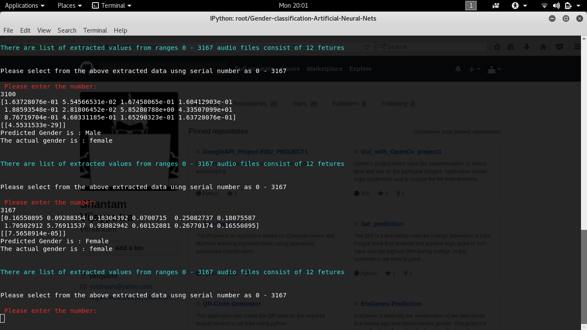

# Grender-classification-Artificial-Neural-Nets

This classifiers the gender of the person speaking in the singular audio file using Artificial Neural Networks

<b> Audio </b>       
         

<b> Male/Female </b>

# Project Structure

file:///root/Gender-classification-Artificial-Neural-Nets
|-- Datasets
|   |-- data.csv
|   |-- pygender
|   |   |-- Test
|   |   |   `-- youtube
|   |   |       |-- female
|   |   |       |   |-- female1.wav
|   |   |       |   |-- female2.wav
|   |   |       |   |-- female3.wav
|   |   |       |   |-- female4.wav
|   |   |       |   `-- female5.wav
|   |   |       `-- male
|   |   |           |-- male1.wav
|   |   |           |-- male2.wav
|   |   |           |-- male3.wav
|   |   |           |-- male4.wav
|   |   |           `-- male5.wav
|   |   `-- Train
|   |       `-- AudioSet
|   |           |-- female_clips
|   |           |   |-- --EQQVMYe50.wav
|   |           |   |-- --IHiTgsaIk.wav
|   |           |   |-- --K91QrLI4g.wav
|   |           |   |-- --VeqKi0cAg.wav
|   |           |   |-- --loQn6BCNI.wav
|   |           |   |-- -3N4z8SJpYU.wav
|   |           |   |-- -4FlKZIo8B4.wav
|   |           |   |-- -6EicsLmZv8.wav
|   |           |   |-- -7cd9myo7J8.wav
|   |           |   |-- -9BXvWo46Zw.wav
|   |           |   |-- -AoetbxSVpU.wav
|   |           |   |-- -CCz11susbg.wav
|   |           |   |-- -CHZ7OM1agU.wav
|   |           |   |-- -DfxoTIiD18.wav
|   |           |   |-- -E2pYZgSAnA.wav
|   |           |   |-- -EBrUZu6198.wav
|   |           |   |-- -Ekd-_5e29c.wav
|   |           |   |-- -FjfDlyXXPI.wav
|   |           |   |-- -GQIBxeAAgA.wav
|   |           |   |-- -Hr1Lhntf3M.wav
|   |           |   |-- -I92KKUFA0A.wav
|   |           |   |-- -IAuM2eOMKI.wav
|   |           |   |-- -J1yoP-hhp8.wav
|   |           |   |-- -JAFFdfXArw.wav
|   |           |   |-- -JOjG2jc1IA.wav
|   |           |   |-- -JdCK8tzFHU.wav
|   |           |   |-- -MoS2c6jOmA.wav
|   |           |   |-- -NL7tuUyLDM.wav
|   |           |   |-- -NVxlAA_Iy0.wav
|   |           |   |-- -Qo6QJo_tJA.wav
|   |           |   |-- -RVryZI5wXw.wav
|   |           |   |-- -RdwbndKkac.wav
|   |           |   |-- -Rl5d0Pb-Ng.wav
|   |           |   |-- -S1KrN_LTfo.wav
|   |           |   |-- -SlN4B7PpvM.wav
|   |           |   |-- -Stm1mHROCY.wav
|   |           |   |-- -TODfZ1_2z0.wav
|   |           |   |-- -Tu57919CYI.wav
|   |           |   |-- -UucHAjDs9Y.wav
|   |           |   |-- -V6lKFFF1-s.wav
|   |           |   |-- -W6_L80DDEo.wav
|   |           |   |-- -Wd0PVtfEK4.wav
|   |           |   |-- -XTvpyHWVOc.wav
|   |           |   |-- -XU4IWPlqOA.wav
|   |           |   |-- -XzW2o9YS9E.wav
|   |           |   |-- -Y5nYQIRkJ0.wav
|   |           |   |-- -YeOvr9eiPE.wav
|   |           |   |-- -Ylu5A5pDMk.wav
|   |           |   |-- -Z5XveH1GeQ.wav
|   |           |   |-- -ZAb6jjMUTM.wav
|   |           |   |-- -ZVD1Y6XXGk.wav
|   |           |   |-- -_TeUwS-1Hs.wav
|   |           |   |-- -_m_h0DBaxw.wav
|   |           |   |-- -_wc9AWT4ys.wav
|   |           |   |-- -agXfEJegKw.wav
|   |           |   |-- -atZkewj7GU.wav
|   |           |   |-- -b9MlwK0GlY.wav
|   |           |   |-- -bD9j4DzQuc.wav
|   |           |   |-- -cCfCIFoQDY.wav
|   |           |   |-- -cDlJ_76Czg.wav
|   |           |   |-- -cbbzxRoOeM.wav
|   |           |   |-- -ckzKMDEpUQ.wav
|   |           |   |-- -cn_xUXJmeY.wav
|   |           |   |-- -de3vPE8Hls.wav
|   |           |   |-- -eJRmdfMlbs.wav
|   |           |   |-- -elLA6vzAig.wav
|   |           |   |-- -h9avIWxYFI.wav
|   |           |   |-- -i1R3gNlFUQ.wav
|   |           |   |-- -iTRb9ze7W0.wav
|   |           |   |-- -jjWi-og5Qs.wav
|   |           |   |-- -lxbjjB7bUk.wav
|   |           |   |-- -mhpQRL24PM.wav
|   |           |   |-- -oO2IvCE_yA.wav
|   |           |   |-- -ourha2xBig.wav
|   |           |   |-- -pHFn_KSw-k.wav
|   |           |   |-- -rL7UizKiGQ.wav
|   |           |   |-- -rkHcQDaJEs.wav
|   |           |   |-- -sF5lJxJps4.wav
|   |           |   |-- -tN-vxr1HjM.wav
|   |           |   |-- -w6gKdlJZTY.wav
|   |           |   |-- -yerHi_SSFw.wav
|   |           |   |-- -zJOSK6_Djg.wav
|   |           |   |-- -zm7kZD9x10.wav
|   |           |   |-- 0--nzZoE_Ho.wav
|   |           |   |-- 00BG6yL5zGw.wav
|   |           |   |-- 014i-70HC_s.wav
|   |           |   |-- 01Q0Se7F28Y.wav
|   |           |   |-- 038H9i5KHlM.wav
|   |           |   |-- 03FIC_TqMQg.wav
|   |           |   |-- 03rU2dEkVsM.wav
|   |           |   |-- 04DeW1O4fm4.wav
|   |           |   |-- 04e9N_422v0.wav
|   |           |   |-- 07FCdFPLLcM.wav
|   |           |   |-- 093EDBZSfFU.wav
|   |           |   |-- 09QIr_mg2-4.wav
|   |           |   |-- 09pMJyKUdyI.wav
|   |           |   |-- 09wYHMyHW_k.wav
|   |           |   |-- 0AjhbWIp7xk.wav
|   |           |   |-- 0B4Zd7MJYjk.wav
|   |           |   |-- 0BAiplxVmys.wav
|   |           |   |-- 0BDsY-sO06g.wav
|   |           |   |-- 0DwgYPhnqxE.wav
|   |           |   |-- 0EyRvpCdD3M.wav
|   |           |   |-- 0G0b96-vK7s.wav
|   |           |   |-- 0G95vM-n_I8.wav
|   |           |   |-- 0GTSnitfoS8.wav
|   |           |   |-- 0HEg26C_Ffc.wav
|   |           |   |-- 0HhzZVQS_xc.wav
|   |           |   |-- 0IRGE4DXZRw.wav
|   |           |   |-- 0JYP1z9tZQw.wav
|   |           |   |-- 0JfWD-jjEFM.wav
|   |           |   |-- 0L3A5mZXHUs.wav
|   |           |   |-- 0LMYIYcYRcg.wav
|   |           |   |-- 0M-hPUiNVks.wav
|   |           |   |-- 0Msrgi5zP78.wav
|   |           |   |-- 0MwAHP0jssY.wav
|   |           |   |-- 0NU9-iSc3rI.wav
|   |           |   |-- 0OEJr_H9ndk.wav
|   |           |   |-- 0PqbHAjKPzg.wav
|   |           |   |-- 0TADwMYhGNM.wav
|   |           |   |-- 0TiPjkcR_Vs.wav
|   |           |   |-- 0TlqrURfgnQ.wav
|   |           |   |-- 0UBHSnsFwo8.wav
|   |           |   |-- 0UKVpF73Uvw.wav
|   |           |   |-- 0XpEG6ryHQA.wav
|   |           |   |-- 0Y6yDg8iWgQ.wav
|   |           |   |-- 0YX8VCUlhfw.wav
|   |           |   |-- 0Z-yS4Pvwvw.wav
|   |           |   |-- 0aM5jnc2FWY.wav
|   |           |   |-- 0bIb6Pjzk1g.wav
|   |           |   |-- 0eFGBtO3-Sg.wav
|   |           |   |-- 0eKLffSmuE4.wav
|   |           |   |-- 0ejhK6V8EtI.wav
|   |           |   |-- 0evPDhk7P-M.wav
|   |           |   |-- 0evZIW8vwDI.wav
|   |           |   |-- 0fHjkiXoook.wav
|   |           |   |-- 0gcNhxl_T6s.wav
|   |           |   |-- 0hWWv_jboP0.wav
|   |           |   |-- 0hhKbeGuSkw.wav
|   |           |   |-- 0i17iB_olSw.wav
|   |           |   |-- 0iTtD8RHj_E.wav
|   |           |   |-- 0ip3tv8NUgs.wav
|   |           |   |-- 0jZtLuEdjrk.wav
|   |           |   |-- 0lLMRXzLcew.wav
|   |           |   |-- 0lMxN8gxcYo.wav
|   |           |   |-- 0lRArRjcbnU.wav
|   |           |   |-- 0m0-NsxVmEo.wav
|   |           |   |-- 0m_o1oo_SRY.wav
|   |           |   |-- 0mipnG5k564.wav
|   |           |   |-- 0mxcPwCLUb0.wav
|   |           |   |-- 0qmhy60KNa8.wav
|   |           |   |-- 0rOymB-hgC4.wav
|   |           |   |-- 0rwlIFdDpro.wav
|   |           |   |-- 0se7kFTtbpk.wav
|   |           |   |-- 0w3J8f2ECFs.wav
|   |           |   |-- 0wb1u-T46ZA.wav
|   |           |   |-- 0yVFLPbxUXM.wav
|   |           |   |-- 0z025oeqQSI.wav
|   |           |   |-- 10_UtJKb9Ys.wav
|   |           |   |-- 13jOTS0UsQA.wav
|   |           |   |-- 13sNoFWrua8.wav
|   |           |   |-- 13v94lbKNz4.wav
|   |           |   |-- 165X-MlBWFA.wav
|   |           |   |-- 16IjSEKCGbo.wav
|   |           |   |-- 16aU0XIiJi8.wav
|   |           |   |-- 16v_TK5fymg.wav
|   |           |   |-- 178NyD2I37s.wav
|   |           |   |-- 17B8vgwvRC8.wav
|   |           |   |-- 1897RroMaWs.wav
|   |           |   |-- 19rdKfXEYeQ.wav
|   |           |   |-- 1APWP5AI4yo.wav
|   |           |   |-- 1Aso5C7nvq0.wav
|   |           |   |-- 1BEonVxnQl8.wav
|   |           |   |-- 1Bov3GgLoY4.wav
|   |           |   |-- 1Byis6WPWkk.wav
|   |           |   |-- 1Cow7LnVss4.wav
|   |           |   |-- 1Ds3YHS60Eg.wav
|   |           |   |-- 1DszEHTpmx0.wav
|   |           |   |-- 1E18RsSBLUA.wav
|   |           |   |-- 1F4XlEubK98.wav
|   |           |   |-- 1F8kDtgfsBs.wav
|   |           |   |-- 1G4jhmmIv_4.wav
|   |           |   |-- 1GujgzNQsLA.wav
|   |           |   |-- 1HOuMsiWyXc.wav
|   |           |   |-- 1HarM99EzG0.wav
|   |           |   |-- 1HpaISOYlJc.wav
|   |           |   |-- 1If_s-8BA2M.wav
|   |           |   |-- 1J9HgcCm_0M.wav
|   |           |   |-- 1KCFLeUaxsQ.wav
|   |           |   |-- 1LREGVehGyw.wav
|   |           |   |-- 1LTw7q3DE3w.wav
|   |           |   |-- 1OqqfyT-XY8.wav
|   |           |   |-- 1P4RTxyrT5k.wav
|   |           |   |-- 1Pn8brsfZ0Y.wav
|   |           |   |-- 1QhuWMuWRqw.wav
|   |           |   |-- 1RrMaovFW4g.wav
|   |           |   |-- 1SCwc3vQsWA.wav
|   |           |   |-- 1SEN5deyHys.wav
|   |           |   |-- 1SSCp3V-IEU.wav
|   |           |   |-- 1SxT5rxKwss.wav
|   |           |   |-- 1U1C8oH-kWM.wav
|   |           |   |-- 1URGvicj3JI.wav
|   |           |   |-- 1V5RfXuZ5w8.wav
|   |           |   |-- 1W8ly-8kFt0.wav
|   |           |   |-- 1WJHXvgzvt8.wav
|   |           |   |-- 1X3yXUw7Pe4.wav
|   |           |   |-- 1XMIboVxwTk.wav
|   |           |   |-- 1XZHJgCwJ3w.wav
|   |           |   |-- 1Y28wk3shiQ.wav
|   |           |   |-- 1YGNWV2pWIc.wav
|   |           |   |-- 1Ylyw8Lic9w.wav
|   |           |   |-- 1Ypu4qbbQDA.wav
|   |           |   |-- 1ZDUp5E1ZzI.wav
|   |           |   |-- 1_8HkujRZOE.wav
|   |           |   |-- 1_Rcwvgecxs.wav
|   |           |   |-- 1aEQRa5fTNA.wav
|   |           |   |-- 1cub3_uCtKs.wav
|   |           |   |-- 1dbHLznStEA.wav
|   |           |   |-- 1dl5bCNQWA4.wav
|   |           |   |-- 1dnFZNXz9_A.wav
|   |           |   |-- 1firq5JazIQ.wav
|   |           |   |-- 1gHWNOb6Aqg.wav
|   |           |   |-- 1gYM0z1AP6I.wav
|   |           |   |-- 1hFF7Wnb2Jo.wav
|   |           |   |-- 1jGGzaXkIZI.wav
|   |           |   |-- 1k1eMJE_hho.wav
|   |           |   |-- 1likZA6vj0o.wav
|   |           |   |-- 1mNKuAu4d4k.wav
|   |           |   |-- 1mrn02mv9IA.wav
|   |           |   |-- 1nQ7cgeXf40.wav
|   |           |   |-- 1nshfO8PBlc.wav
|   |           |   |-- 1oTFh3nwgNY.wav
|   |           |   |-- 1p4s5YAA-6g.wav
|   |           |   |-- 1q5fJHQQXlo.wav
|   |           |   |-- 1qQ0OCG3nQo.wav
|   |           |   |-- 1qXbCHgo6cc.wav
|   |           |   |-- 1qoYuK8Z4PI.wav
|   |           |   |-- 1rewutX_d-k.wav
|   |           |   |-- 1sx1J-ZvRD4.wav
|   |           |   |-- 1uyHRtI8mW0.wav
|   |           |   |-- 1vBrnwzTE-U.wav
|   |           |   |-- 1y1ApWNzWWo.wav
|   |           |   |-- 1zDJtN5-dfg.wav
|   |           |   |-- 1zyjBJclArM.wav
|   |           |   |-- 2-v0OLy6xxs.wav
|   |           |   |-- 20SAF4ZdloM.wav
|   |           |   |-- 21GASyBbyKw.wav
|   |           |   |-- 257Puu53ZoA.wav
|   |           |   |-- 27-5GiUQ7fE.wav
|   |           |   |-- 273zOsJes8Y.wav
|   |           |   |-- 28HWviT0gyI.wav
|   |           |   |-- 2BASEDwYDRA.wav
|   |           |   |-- 2BEpppem4bA.wav
|   |           |   |-- 2D3_TrcRV4Q.wav
|   |           |   |-- 2EaFFLlZx60.wav
|   |           |   |-- 2F0Sqy2va40.wav
|   |           |   |-- 2GH5VpSeED4.wav
|   |           |   |-- 2IE-DlI82IY.wav
|   |           |   |-- 2I_dthy5rhI.wav
|   |           |   |-- 2JhpopjcJS0.wav
|   |           |   |-- 2JxSDaT4X9s.wav
|   |           |   |-- 2POub4l90n4.wav
|   |           |   |-- 2PmhlW1sg8Y.wav
|   |           |   |-- 2QZTY-iCR9o.wav
|   |           |   |-- 2QZmSEzCgUk.wav
|   |           |   |-- 2SoVrTCY2gQ.wav
|   |           |   |-- 2WV3vpJqZ1M.wav
|   |           |   |-- 2WWZWi5sw4U.wav
|   |           |   |-- 2YYUDrX8bJw.wav
|   |           |   |-- 2_1yFpevPow.wav
|   |           |   |-- 2_3P73g4M7M.wav
|   |           |   |-- 2_E3K_yAYDM.wav
|   |           |   |-- 2_gZBMVfJpU.wav
|   |           |   |-- 2cO30xcF49U.wav
|   |           |   |-- 2e82MGzQcKo.wav
|   |           |   |-- 2ePKQKl9jtc.wav
|   |           |   |-- 2f4s67hUx1Q.wav
|   |           |   |-- 2flcW_FbnZU.wav
|   |           |   |-- 2fsBTlm6STY.wav
|   |           |   |-- 2gQSnCNrQdA.wav
|   |           |   |-- 2guQrRrt1Gk.wav
|   |           |   |-- 2iZsq34S72I.wav
|   |           |   |-- 2ifwSdBCfLs.wav
|   |           |   |-- 2jR4V4WS-pI.wav
|   |           |   |-- 2k9nn7LmFzc.wav
|   |           |   |-- 2ljQVlmRqOI.wav
|   |           |   |-- 2ll7CeyebZo.wav
|   |           |   |-- 2mffYooE8Wo.wav
|   |           |   |-- 2nF6fL0h0qM.wav
|   |           |   |-- 2nmGk1I-PaM.wav
|   |           |   |-- 2v2TfV1MpIU.wav
|   |           |   |-- 2v8CrKW_yQc.wav
|   |           |   |-- 2vN77gHhWAA.wav
|   |           |   |-- 2veTQ-XMei8.wav
|   |           |   |-- 2xVVD5EHkog.wav
|   |           |   |-- 3-yBJ3adUz4.wav
|   |           |   |-- 30s7YiUQ3RE.wav
|   |           |   |-- 31JB68E_FYU.wav
|   |           |   |-- 32DyiIY3pW0.wav
|   |           |   |-- 34KJJLpw4Ck.wav
|   |           |   |-- 35KLb0tUd0U.wav
|   |           |   |-- 387-RDJj8EE.wav
|   |           |   |-- 39M82hRay6s.wav
|   |           |   |-- 39_-S6yQU0k.wav
|   |           |   |-- 39plKCacEMM.wav
|   |           |   |-- 3Bcb-R9Ofkk.wav
|   |           |   |-- 3Bh_CiOLEy8.wav
|   |           |   |-- 3DFHz19nqIs.wav
|   |           |   |-- 3EsbeUy2xk4.wav
|   |           |   |-- 3Ey9Yjas0vs.wav
|   |           |   |-- 3FP-73TCFKU.wav
|   |           |   |-- 3GGleJqE_fY.wav
|   |           |   |-- 3HPruK7vD28.wav
|   |           |   |-- 3HYiX64fDXw.wav
|   |           |   |-- 3JZYjKLcJ8Y.wav
|   |           |   |-- 3KJWLzEFlQM.wav
|   |           |   |-- 3KKAEAGT5DY.wav
|   |           |   |-- 3LKAtzqEfLs.wav
|   |           |   |-- 3My3TWp4ZrI.wav
|   |           |   |-- 3NKEAULaXa4.wav
|   |           |   |-- 3O4YRGIa9XY.wav
|   |           |   |-- 3OXaaF_ulyY.wav
|   |           |   |-- 3PFYZzqWgAs.wav
|   |           |   |-- 3PWJjg065DM.wav
|   |           |   |-- 3PqwrWf8axs.wav
|   |           |   |-- 3QKYTXQ0x6c.wav
|   |           |   |-- 3RkeDdWBCLE.wav
|   |           |   |-- 3RnfmeBNwjI.wav
|   |           |   |-- 3RniDh2rgTI.wav
|   |           |   |-- 3UZrDe9ElqA.wav
|   |           |   |-- 3UfhuMd6HSM.wav
|   |           |   |-- 3UpRM5VRxJo.wav
|   |           |   |-- 3UrqkTOtWeU.wav
|   |           |   |-- 3UxYjBlHf-U.wav
|   |           |   |-- 3VnBYO46iEc.wav
|   |           |   |-- 3WY6ee7oPCc.wav
|   |           |   |-- 3Wrq6AnYuxI.wav
|   |           |   |-- 3X3r5EXfWYY.wav
|   |           |   |-- 3Y0a1uw9jSo.wav
|   |           |   |-- 3ZGYbGIzfv0.wav
|   |           |   |-- 3aFCWnNAu0o.wav
|   |           |   |-- 3cJjFfFHr9w.wav
|   |           |   |-- 3cflSj0FASU.wav
|   |           |   |-- 3dvCFqBuud0.wav
|   |           |   |-- 3eshe6JYBwM.wav
|   |           |   |-- 3fyLnSrjk3Q.wav
|   |           |   |-- 3g-m3swppt0.wav
|   |           |   |-- 3g3-msKdDt8.wav
|   |           |   |-- 3gL-av1-BUA.wav
|   |           |   |-- 3gUPjyXigzE.wav
|   |           |   |-- 3gqzB0l1gtY.wav
|   |           |   |-- 3hu1RqDsfQY.wav
|   |           |   |-- 3j6xIsCWQ4k.wav
|   |           |   |-- 3kF5YG69Cd0.wav
|   |           |   |-- 3mQUdzhF5k0.wav
|   |           |   |-- 3mzSzexbHGA.wav
|   |           |   |-- 3ofhj9UUnkQ.wav
|   |           |   |-- 3q6iQW8gsU0.wav
|   |           |   |-- 3qRHsNnPpHo.wav
|   |           |   |-- 3qsJ_Matdso.wav
|   |           |   |-- 3rFLBLhYTd8.wav
|   |           |   |-- 3riLt6CscP0.wav
|   |           |   |-- 3sy-j4s2ERo.wav
|   |           |   |-- 3udWqzZibWY.wav
|   |           |   |-- 3uq2UoeLcTc.wav
|   |           |   |-- 3v42HeP9Tk0.wav
|   |           |   |-- 3xTJWmWqtCU.wav
|   |           |   |-- 3xclJdr4dek.wav
|   |           |   |-- 3yxgoweNqEc.wav
|   |           |   |-- 4-H6IsDRMOc.wav
|   |           |   |-- 4-Nt1j1mI5A.wav
|   |           |   |-- 4-d38s9my84.wav
|   |           |   |-- 4-i9WsjCFj8.wav
|   |           |   |-- 40d3H-UJQGo.wav
|   |           |   |-- 424mN8XvYTY.wav
|   |           |   |-- 42piJ1ZXUVo.wav
|   |           |   |-- 43ebT9qP0Ws.wav
|   |           |   |-- 4494cj35eoM.wav
|   |           |   |-- 463oP1ek9Yk.wav
|   |           |   |-- 47qviOA6uSQ.wav
|   |           |   |-- 48TTVcqUzwc.wav
|   |           |   |-- 48lI9IZsHxE.wav
|   |           |   |-- 497QF_Eavpc.wav
|   |           |   |-- 4990ozS4ZGA.wav
|   |           |   |-- 49VvGoYqyMs.wav
|   |           |   |-- 49XPYmcbYyg.wav
|   |           |   |-- 4B1YxK0_wYc.wav
|   |           |   |-- 4BuIKuEGSSM.wav
|   |           |   |-- 4Bun0uRbqdI.wav
|   |           |   |-- 4D-8LFC_eMU.wav
|   |           |   |-- 4D8zMSt2am0.wav
|   |           |   |-- 4Da7jd7y6tQ.wav
|   |           |   |-- 4Duv4yXbkN8.wav
|   |           |   |-- 4ENso36jKO4.wav
|   |           |   |-- 4FbUqDRYsI4.wav
|   |           |   |-- 4Fbprv9eVoY.wav
|   |           |   |-- 4FulVU5-7XI.wav
|   |           |   |-- 4Ih95WHj8Sk.wav
|   |           |   |-- 4Jl5x515MiY.wav
|   |           |   |-- 4KHuK32spL4.wav
|   |           |   |-- 4M1ng4MadYI.wav
|   |           |   |-- 4M4IMk2YApk.wav
|   |           |   |-- 4MtQlyzXLyk.wav
|   |           |   |-- 4NV9qjhae3E.wav
|   |           |   |-- 4P66BSca8RY.wav
|   |           |   |-- 4PSBW_Aj9cc.wav
|   |           |   |-- 4QFFIjeMD78.wav
|   |           |   |-- 4QWRQw-W6ss.wav
|   |           |   |-- 4QqEt_tmrtI.wav
|   |           |   |-- 4SG5_5E44bU.wav
|   |           |   |-- 4TJ6wQjVgIk.wav
|   |           |   |-- 4TyzMcpMlv0.wav
|   |           |   |-- 4UorCvBvSe8.wav
|   |           |   |-- 4W5FaKdE4Ow.wav
|   |           |   |-- 4XphmruuEBA.wav
|   |           |   |-- 4a9PF5fMcf4.wav
|   |           |   |-- 4aVulGFmbIE.wav
|   |           |   |-- 4auplyzWz6A.wav
|   |           |   |-- 4b_xNZFVFbI.wav
|   |           |   |-- 4ciWIKT9sPQ.wav
|   |           |   |-- 4dU_sVfN8fI.wav
|   |           |   |-- 4df_9OlBVg4.wav
|   |           |   |-- 4drWL_Zs_wA.wav
|   |           |   |-- 4ejWL4nS94A.wav
|   |           |   |-- 4f1w7_vdLTI.wav
|   |           |   |-- 4gAVXFtqTyI.wav
|   |           |   |-- 4h-453a-5tg.wav
|   |           |   |-- 4hVSMaSoXaw.wav
|   |           |   |-- 4i-c2ViKKFo.wav
|   |           |   |-- 4jk63c84kr0.wav
|   |           |   |-- 4k1qJy0rc1I.wav
|   |           |   |-- 4lBTenfUFoU.wav
|   |           |   |-- 4laXqT968oY.wav
|   |           |   |-- 4m_rSC_jV6k.wav
|   |           |   |-- 4nAD2uEMCq8.wav
|   |           |   |-- 4nTcoySgx1Q.wav
|   |           |   |-- 4o3N_FYuJ3g.wav
|   |           |   |-- 4oc8JnUvPrM.wav
|   |           |   |-- 4oyKvvYaKlA.wav
|   |           |   |-- 4p20SR0e2Uc.wav
|   |           |   |-- 4qXxbVCuHuw.wav
|   |           |   |-- 4qvqjzQYmXk.wav
|   |           |   |-- 4rSIgRMjMqo.wav
|   |           |   |-- 4rehS_cPodk.wav
|   |           |   |-- 4ryqv_AVXB4.wav
|   |           |   |-- 4t9OYmcCZ6U.wav
|   |           |   |-- 4uLcBW0gBSk.wav
|   |           |   |-- 4v0vv6ujNCw.wav
|   |           |   |-- 4vKMsJgX6SE.wav
|   |           |   |-- 4wJzpVpJKlU.wav
|   |           |   |-- 4wyCBF5CsCA.wav
|   |           |   |-- 4xnzO6JJ4E8.wav
|   |           |   |-- 4zOYDrLVZzo.wav
|   |           |   |-- 5-0kMUNmBHo.wav
|   |           |   |-- 51Q2svWoaOo.wav
|   |           |   |-- 51rpHNf_zfI.wav
|   |           |   |-- 524VM5HFeus.wav
|   |           |   |-- 5312urKnWVA.wav
|   |           |   |-- 53B8xlq2kCY.wav
|   |           |   |-- 53VCm2Yx5ro.wav
|   |           |   |-- 53aBnspP90I.wav
|   |           |   |-- 53lthhUaxKU.wav
|   |           |   |-- 54F98NkNUQY.wav
|   |           |   |-- 55TB8FYppCY.wav
|   |           |   |-- 57nFauAZHAg.wav
|   |           |   |-- 57uHvLfi2WY.wav
|   |           |   |-- 57zXDpyeamg.wav
|   |           |   |-- 588LpLnkcHI.wav
|   |           |   |-- 5AEZkWl9zYo.wav
|   |           |   |-- 5BQ2xV8Yauo.wav
|   |           |   |-- 5C-HR9ROsC4.wav
|   |           |   |-- 5CXP_n2Emf0.wav
|   |           |   |-- 5DUDEvEL4LU.wav
|   |           |   |-- 5EMBN_76P3Y.wav
|   |           |   |-- 5E_KyP5fhH0.wav
|   |           |   |-- 5GjaOpBNdJo.wav
|   |           |   |-- 5Gm-TuMq8Sk.wav
|   |           |   |-- 5GxRtWeTn_I.wav
|   |           |   |-- 5HBa7zAGAxE.wav
|   |           |   |-- 5Hs4o9kbIeo.wav
|   |           |   |-- 5IiGOAI6oj0.wav
|   |           |   |-- 5IwpBqlypCw.wav
|   |           |   |-- 5JpIvpVpPgs.wav
|   |           |   |-- 5LltO9RjC-s.wav
|   |           |   |-- 5NhC84Zu0BI.wav
|   |           |   |-- 5NyptRLEr2A.wav
|   |           |   |-- 5Os2SFPY_XY.wav
|   |           |   |-- 5U95LLrU07A.wav
|   |           |   |-- 5UCslcbSiA0.wav
|   |           |   |-- 5US3-l0G5nQ.wav
|   |           |   |-- 5WRGTnmoXNo.wav
|   |           |   |-- 5XU3U_8L0lQ.wav
|   |           |   |-- 5XsQ8_iDSZk.wav
|   |           |   |-- 5YAbC9yuk_Y.wav
|   |           |   |-- 5YRi9ErI1zo.wav
|   |           |   |-- 5YYFt6GeimI.wav
|   |           |   |-- 5Z9uNuBR2zc.wav
|   |           |   |-- 5ZHejEtYfVU.wav
|   |           |   |-- 5bx7gZWz5ho.wav
|   |           |   |-- 5ei0lqnGqho.wav
|   |           |   |-- 5ez44TnEG_M.wav
|   |           |   |-- 5fGaQdH-wLw.wav
|   |           |   |-- 5gfzL7oGQFc.wav
|   |           |   |-- 5i425wdu3TE.wav
|   |           |   |-- 5ichne6N6Do.wav
|   |           |   |-- 5jph2RE5Uek.wav
|   |           |   |-- 5mBlwHh5RG4.wav
|   |           |   |-- 5mF8SsbQZOE.wav
|   |           |   |-- 5muO0kJS-kI.wav
|   |           |   |-- 5nmzCOSaNo8.wav
|   |           |   |-- 5oF9nq8ykek.wav
|   |           |   |-- 5p8JjptnZGo.wav
|   |           |   |-- 5qOO_K52ZMg.wav
|   |           |   |-- 5qc5gOlIUtQ.wav
|   |           |   |-- 5qgOlEcr7Yw.wav
|   |           |   |-- 5qmS_XQCXRg.wav
|   |           |   |-- 5sAXa6xtsBc.wav
|   |           |   |-- 5tJ_S7gAv1k.wav
|   |           |   |-- 5tc75V2HgT8.wav
|   |           |   |-- 5u8R1AX1Vn0.wav
|   |           |   |-- 5uUrAL6pGto.wav
|   |           |   |-- 5uqSlLGwXKU.wav
|   |           |   |-- 5vb0Q0hk3uM.wav
|   |           |   |-- 5wCCcUh2CoE.wav
|   |           |   |-- 5wgCoRm_O0w.wav
|   |           |   |-- 5wpJUpFnfvs.wav
|   |           |   |-- 5wwBX9Tjis8.wav
|   |           |   |-- 5x3JBjSvc98.wav
|   |           |   |-- 5xfYPjDNRf4.wav
|   |           |   |-- 5y1zwz2jcUQ.wav
|   |           |   |-- 5z4AHK3I1-g.wav
|   |           |   |-- 5zlBHEBx_ns.wav
|   |           |   |-- 60Ew7jswN6A.wav
|   |           |   |-- 61d0zvVfnVA.wav
|   |           |   |-- 62FGR8Y-Ovc.wav
|   |           |   |-- 62ZYD0usLEQ.wav
|   |           |   |-- 64CAIHKFz4E.wav
|   |           |   |-- 65ibQff-H6E.wav
|   |           |   |-- 65me0Xyv79c.wav
|   |           |   |-- 66OMpdX70cw.wav
|   |           |   |-- 66sZmNqUpyo.wav
|   |           |   |-- 672d2_o2eYM.wav
|   |           |   |-- 67H_n0iHoeU.wav
|   |           |   |-- 69bE-7APERA.wav
|   |           |   |-- 6AobosKTswk.wav
|   |           |   |-- 6BAv2MKpFeQ.wav
|   |           |   |-- 6CB79qSX5oI.wav
|   |           |   |-- 6CT4WLbGmc4.wav
|   |           |   |-- 6CsnJo4zsLU.wav
|   |           |   |-- 6DCjY3ELFeE.wav
|   |           |   |-- 6DbuTD9xPj0.wav
|   |           |   |-- 6FJsmTioNkc.wav
|   |           |   |-- 6FZuS42Apks.wav
|   |           |   |-- 6FpFqBxK1fE.wav
|   |           |   |-- 6Gs203QrJ3A.wav
|   |           |   |-- 6GuJBAqcp8E.wav
|   |           |   |-- 6HG4U7Zs4SI.wav
|   |           |   `-- 6HNGoQ6Z9Ms.wav
|   |           `-- male_clips
|   |               |-- -0CAdy06NRo.wav
|   |               |-- -0DO0ulATPY.wav
|   |               |-- -0SQayvXyIQ.wav
|   |               |-- -0kDcUEDfmY.wav
|   |               |-- -0l8Gjpj4Fs.wav
|   |               |-- -2Lu0SNCewQ.wav
|   |               |-- -2uzId2wIk0.wav
|   |               |-- -2xvB13pgTY.wav
|   |               |-- -_PSNlwpF3g.wav
|   |               |-- -_V11mBMB3w.wav
|   |               |-- -_vMsD39GRU.wav
|   |               |-- 0-Rf6bTD5fs.wav
|   |               |-- 0-aEZiPFkzE.wav
|   |               |-- 0-fbzIBkp6Q.wav
|   |               |-- 001L31licAI.wav
|   |               |-- 00AoQ3PeETk.wav
|   |               |-- 00W3TGhk0I0.wav
|   |               |-- 01XLpfOIIKM.wav
|   |               |-- 01_sfLC74xs.wav
|   |               |-- 03dT_C8vzjQ.wav
|   |               |-- 03jx_EHREPQ.wav
|   |               |-- 0AA2j_1eDYc.wav
|   |               |-- 0ACJsiUiGHI.wav
|   |               |-- 0AHKu1Y5jq4.wav
|   |               |-- 0ALEcExqrTY.wav
|   |               |-- 0A_dWHw8L6g.wav
|   |               |-- 0B76EIZLk2Y.wav
|   |               |-- 0BKuwfKBHK8.wav
|   |               |-- 0BR4cN_TRU4.wav
|   |               |-- 0BV2NBQzQ5A.wav
|   |               |-- 0BgdSZVJ8EI.wav
|   |               |-- 0Bpo-3wPIcY.wav
|   |               |-- 0C98F5ADalo.wav
|   |               |-- 0EE5qhX1Nzs.wav
|   |               |-- 0EJFXZmK4LM.wav
|   |               |-- 0EsUYsEShpY.wav
|   |               |-- 0EuuLjyRLMY.wav
|   |               |-- 0F8-h9-cETM.wav
|   |               |-- 0FF2Dm9GMDE.wav
|   |               |-- 0FFgEG9dTfk.wav
|   |               |-- 0FHzxpwBfY4.wav
|   |               |-- 0FLWL2uj3ws.wav
|   |               |-- 0FSZItjJhRA.wav
|   |               |-- 0Fjp9pOAxL0.wav
|   |               |-- 0FtSfUSy28w.wav
|   |               |-- 0GG1up9KyVo.wav
|   |               |-- 0GJsOYhaGW4.wav
|   |               |-- 0Gbx9S44IPE.wav
|   |               |-- 0Gmo2e5uaGU.wav
|   |               |-- 0GxJ2a8UFQg.wav
|   |               |-- 0HNpOK8hpFA.wav
|   |               |-- 0HWqcIEUJjE.wav
|   |               |-- 0He01mhNC_4.wav
|   |               |-- 0IZKgWhfhh4.wav
|   |               |-- 0IlTnSZcf_k.wav
|   |               |-- 0J7wkamxOyk.wav
|   |               |-- 0JdVacoORpU.wav
|   |               |-- 0JpKnlT39jo.wav
|   |               |-- 0Jw5QUwSyGY.wav
|   |               |-- 0Jy76Q2ULjA.wav
|   |               |-- 0K5AJjNHSg4.wav
|   |               |-- 0KCkpiagpOQ.wav
|   |               |-- 0KH9lEC29gM.wav
|   |               |-- 0KKChHiDBEc.wav
|   |               |-- 0KWB5S6tF2g.wav
|   |               |-- 0KhyNyCv2Fs.wav
|   |               |-- 0KnzLYltnds.wav
|   |               |-- 0MIwtXJ66vU.wav
|   |               |-- 0MekMqiPc3A.wav
|   |               |-- 0Mk96zcUQp8.wav
|   |               |-- 0Nm3peafdnk.wav
|   |               |-- 0NvnW0bdAc8.wav
|   |               |-- 0O73b0VBytI.wav
|   |               |-- 0OC5HzIqUx8.wav
|   |               |-- 0OUlys-rLYs.wav
|   |               |-- 0Og-abKWL8g.wav
|   |               |-- 0OzwOMjZhWw.wav
|   |               |-- 0PGdsvvYLag.wav
|   |               |-- 0PRVVZXqqv4.wav
|   |               |-- 0PS5dpjl7Vk.wav
|   |               |-- 0P_l1KRQ6KQ.wav
|   |               |-- 0Q5GLOlJ9B8.wav
|   |               |-- 0QFYCxbsTvY.wav
|   |               |-- 0QUHl5caDjQ.wav
|   |               |-- 0QWA8pbm0x0.wav
|   |               |-- 0Qt3f3Mj2Gs.wav
|   |               |-- 0R32-DDBs1E.wav
|   |               |-- 0RA7iKKR9Rw.wav
|   |               |-- 0RI_PPht6Is.wav
|   |               |-- 0RSNMD8Sd6Y.wav
|   |               |-- 0RrBcotVa4Y.wav
|   |               |-- 0RxKhT1bLsc.wav
|   |               |-- 0SQV2ZFtlXc.wav
|   |               |-- 0TMpxH3cgWs.wav
|   |               |-- 0TaWSAPNKNg.wav
|   |               |-- 0TcNt0CBXMQ.wav
|   |               |-- 0TrSFbV8t8E.wav
|   |               |-- 0UGEPNFwt70.wav
|   |               |-- 0UYYgAD5TlM.wav
|   |               |-- 0UjRBr8FOWY.wav
|   |               |-- 0VGRhxCkdFU.wav
|   |               |-- 0V_D_oT3Tio.wav
|   |               |-- 0Vk5rDaq-vo.wav
|   |               |-- 0Vmzk_Pv7LM.wav
|   |               |-- 0VoXv1N2Vzk.wav
|   |               |-- 0WWgLr7pz1c.wav
|   |               |-- 0WcuPZDwLRY.wav
|   |               |-- 0Z8NrQXUJ-E.wav
|   |               |-- 0ZJQ0LPLaJ8.wav
|   |               |-- 0ZU7--PwcJ4.wav
|   |               |-- 0ZeluKxEdWc.wav
|   |               |-- 0_YaD5Vp4u0.wav
|   |               |-- 0_jKejnghbs.wav
|   |               |-- 0aFEBWjJYs0.wav
|   |               |-- 0aPGq3ovKCI.wav
|   |               |-- 0b71FSElGHg.wav
|   |               |-- 0boHQmODX1g.wav
|   |               |-- 0byHFKyvR8M.wav
|   |               |-- 0bz1ZlpTbOU.wav
|   |               |-- 0cMQfSMOyxA.wav
|   |               |-- 0cTu6OehrGs.wav
|   |               |-- 0cuT8Db7uzM.wav
|   |               |-- 0d7rOgWzo4s.wav
|   |               |-- 0dIN4KUhIOQ.wav
|   |               |-- 0dbXYJGN2-4.wav
|   |               |-- 0dgH2-QrCPc.wav
|   |               |-- 0doFG6PA1vs.wav
|   |               |-- 0eUVrBEBXRU.wav
|   |               |-- 0eV6y2C-iEg.wav
|   |               |-- 0eyYEp4ixOY.wav
|   |               |-- 0fcQj9-pBr4.wav
|   |               |-- 0hGtCTlYRL8.wav
|   |               |-- 0hQatz19y60.wav
|   |               |-- 0hWNhvmwyyI.wav
|   |               |-- 0iBPL9MlL_o.wav
|   |               |-- 0iQsH7R0H_8.wav
|   |               |-- 0jI4h3vNdE4.wav
|   |               |-- 0kPMDTAiXr4.wav
|   |               |-- 0kl8LxBEN5g.wav
|   |               |-- 0lAipnXwEL8.wav
|   |               |-- 0luMelmZxKk.wav
|   |               |-- 0m42oUro8sw.wav
|   |               |-- 0mP6qSbwXK0.wav
|   |               |-- 0msYQryBpyU.wav
|   |               |-- 0nwvvx5RRI8.wav
|   |               |-- 0o9-HIlQjJM.wav
|   |               |-- 0oDUccb_Tdg.wav
|   |               |-- 0pG_UoXAeq4.wav
|   |               |-- 0pe9Azqa3N8.wav
|   |               |-- 0pirUheQh8I.wav
|   |               |-- 0pkmm3wTJ2g.wav
|   |               |-- 0plkRQScvoM.wav
|   |               |-- 0q8rSPfYzQI.wav
|   |               |-- 0qPz8ZsYFQY.wav
|   |               |-- 0qV2QTJr_Hk.wav
|   |               |-- 0qbhN2wWeiQ.wav
|   |               |-- 0r2pn8X1x0E.wav
|   |               |-- 0rCdk2iMHSQ.wav
|   |               |-- 0s9qC5gqgVQ.wav
|   |               |-- 0sLPov4H1Xo.wav
|   |               |-- 0slxgU9DaPg.wav
|   |               |-- 0smPGDRVXtM.wav
|   |               |-- 0teztS_qDv0.wav
|   |               |-- 0tgFa4586Gg.wav
|   |               |-- 0tni9i7pSgc.wav
|   |               |-- 0uD4hwJHaYU.wav
|   |               |-- 0ucfyAeug8E.wav
|   |               |-- 0ukcRot3XL0.wav
|   |               |-- 0uxC0Kul7as.wav
|   |               |-- 0vO0D_nqG2A.wav
|   |               |-- 0vYCIMHcV1g.wav
|   |               |-- 0vwpdlGsoKE.wav
|   |               |-- 0wRBb_5JAKU.wav
|   |               |-- 0wqWDh_cGN0.wav
|   |               |-- 0xP4cFo4rzA.wav
|   |               |-- 0xQ9mBXNrpY.wav
|   |               |-- 0xcmsefaFy4.wav
|   |               |-- 0yIee-OG60Y.wav
|   |               |-- 0yWolUNeBzE.wav
|   |               |-- 0yjCNGc9Nrs.wav
|   |               |-- 0zwCstVUhqo.wav
|   |               |-- 0zz6Hz52uHs.wav
|   |               |-- 1-PCcgLJgt8.wav
|   |               |-- 1-cWNpmCEyk.wav
|   |               |-- 1-mE_i1zZ0Y.wav
|   |               |-- 1-wdrZMz8g8.wav
|   |               |-- 1A3YMwuv2RY.wav
|   |               |-- 1ATWtIF9sww.wav
|   |               |-- 1AiR1nvcGco.wav
|   |               |-- 1BLQ6o8-zE8.wav
|   |               |-- 1BhjgD6yJFo.wav
|   |               |-- 1Bj6Kpd91TI.wav
|   |               |-- 1BqefTrj_7Y.wav
|   |               |-- 1BujM47cIC8.wav
|   |               |-- 1C2V_lUbaH0.wav
|   |               |-- 1CJkDeFjh-o.wav
|   |               |-- 1CQv5sEVXyU.wav
|   |               |-- 1CTtEckzm5k.wav
|   |               |-- 1CYU07uzqyA.wav
|   |               |-- 1Denb3DwJc0.wav
|   |               |-- 1DkNPt7Z4s4.wav
|   |               |-- 1E1FrSujyxw.wav
|   |               |-- 1E35uS6Zcr0.wav
|   |               |-- 1E9iiNJ7ExU.wav
|   |               |-- 1EMPFpvaGQU.wav
|   |               |-- 1ExsYewMwig.wav
|   |               |-- 1FKo8SmyVQo.wav
|   |               |-- 1FWPpWW79PM.wav
|   |               |-- 1FrddSb4iyc.wav
|   |               |-- 1GfNeIgK4tY.wav
|   |               |-- 1GkMInhcPz4.wav
|   |               |-- 1GoTKNyYFvE.wav
|   |               |-- 1H3-Qh0HJyo.wav
|   |               |-- 1IU9PLVUOc8.wav
|   |               |-- 1IVsSbOadbY.wav
|   |               |-- 1J0-to2qUlk.wav
|   |               |-- 1JEDH5bBgU4.wav
|   |               |-- 1J_vZasOhn8.wav
|   |               |-- 1K1sd3tFLEg.wav
|   |               |-- 1KJ70xg4ESA.wav
|   |               |-- 1KWNvjcsmpU.wav
|   |               |-- 1KpXih9NtOc.wav
|   |               |-- 1KvLtqm2cn4.wav
|   |               |-- 1L7n5Z4De5Q.wav
|   |               |-- 1LYnQp2D7bk.wav
|   |               |-- 1Lku83dVe2k.wav
|   |               |-- 1LosZo4fjA8.wav
|   |               |-- 1MDZysEe1bA.wav
|   |               |-- 1MDbLfSIa6E.wav
|   |               |-- 1MrPhiuh_5Q.wav
|   |               |-- 1NPA7T3abOc.wav
|   |               |-- 1NbrssOdBzw.wav
|   |               |-- 1NuORBZJeLE.wav
|   |               |-- 1Ny2V_DJIrQ.wav
|   |               |-- 1OOu43bVoUk.wav
|   |               |-- 1OoQSBFXEoY.wav
|   |               |-- 1PB3fPp0M3k.wav
|   |               |-- 1PQTUvTAo_I.wav
|   |               |-- 1PcuphpNjMU.wav
|   |               |-- 1Pde82OWf-8.wav
|   |               |-- 1PnyLsNN95I.wav
|   |               |-- 1QDOcfA2lqA.wav
|   |               |-- 1R5RlCZCBS4.wav
|   |               |-- 1R5pWk08pVc.wav
|   |               |-- 1Rdjv2ZX8j4.wav
|   |               |-- 1SGtzFyRnhg.wav
|   |               |-- 1U7VrKcbKJw.wav
|   |               |-- 1UN8RbIuGs8.wav
|   |               |-- 1UTzuxR4U7Q.wav
|   |               |-- 1UUjhgpQHsU.wav
|   |               |-- 1UyEoGq5Irc.wav
|   |               |-- 1V8z4is1dUw.wav
|   |               |-- 1VG5iWjsCWE.wav
|   |               |-- 1VSkXVP6SOM.wav
|   |               |-- 1VlAzJpW5uE.wav
|   |               |-- 1Wbx9UoY0ck.wav
|   |               |-- 1XD1_7bRpOQ.wav
|   |               |-- 1Yi_PXrlDYc.wav
|   |               |-- 1ZCP8VykJRM.wav
|   |               |-- 1ZMOrTEdoiU.wav
|   |               |-- 1_-bBXMKNVI.wav
|   |               |-- 1_CzE8eb8qU.wav
|   |               |-- 1_U5kef5I0w.wav
|   |               |-- 1_elbwulpvc.wav
|   |               |-- 1_uww84X-E0.wav
|   |               |-- 1a33yMXWIrA.wav
|   |               |-- 1aCSRbVLQsA.wav
|   |               |-- 1a_uGYQS8LU.wav
|   |               |-- 1acagfP1-48.wav
|   |               |-- 1afyiNa-4is.wav
|   |               |-- 1cHF693l06A.wav
|   |               |-- 1cL8P-_ZgiQ.wav
|   |               |-- 1crNGQHaZ5c.wav
|   |               |-- 1cxqTqHYQQw.wav
|   |               |-- 1dDOmr-HYac.wav
|   |               |-- 1dZGT14rUVA.wav
|   |               |-- 1diqMs7UoRE.wav
|   |               |-- 1fP1YJATYew.wav
|   |               |-- 1faF0rt_yCA.wav
|   |               |-- 1g53wmFxOxc.wav
|   |               |-- 1gw9HIHRMy8.wav
|   |               |-- 1h4893C62M0.wav
|   |               |-- 1h9L6XMH_7A.wav
|   |               |-- 1hg8tBfWhcM.wav
|   |               |-- 1hvujC7hCxM.wav
|   |               |-- 1i0Q_NyS_CM.wav
|   |               |-- 1i1KzoDJovQ.wav
|   |               |-- 1i1tNsxDt-s.wav
|   |               |-- 1iLvFwaYUro.wav
|   |               |-- 1idCnP571Ps.wav
|   |               |-- 1jYQf7GTwko.wav
|   |               |-- 1jcRhzQDnLQ.wav
|   |               |-- 1kdqfVb49Co.wav
|   |               |-- 1kkJ8P7vehI.wav
|   |               |-- 1lAOLewZ7WM.wav
|   |               |-- 1lKAKPsRyr8.wav
|   |               |-- 1lW86bAu9Zs.wav
|   |               |-- 1lkV5kMz9Qc.wav
|   |               |-- 1lyMUsy3lvg.wav
|   |               |-- 1mzCQe_rIP8.wav
|   |               |-- 1nSUvZlLMt8.wav
|   |               |-- 1nVA5qrdD18.wav
|   |               |-- 1oD_UctTPyY.wav
|   |               |-- 1p7VsqTCMBA.wav
|   |               |-- 1pClGYt-NC0.wav
|   |               |-- 1pk0HJr6T1Y.wav
|   |               |-- 1prex72I0fM.wav
|   |               |-- 1px1bRXDtck.wav
|   |               |-- 1q-T2XeBkaI.wav
|   |               |-- 1q5AphZK6uA.wav
|   |               |-- 1qlQwFHORyY.wav
|   |               |-- 1qz9BPjURAQ.wav
|   |               |-- 1rJURzEcvFY.wav
|   |               |-- 1riV9S-tknQ.wav
|   |               |-- 1s-61J1hRlI.wav
|   |               |-- 1s6xOx6Az-Q.wav
|   |               |-- 1sMfu2ixk3U.wav
|   |               |-- 1sWA81h-C6Y.wav
|   |               |-- 1sa-gzsvqp4.wav
|   |               |-- 1srDsQWuGrw.wav
|   |               |-- 1svXxbckGtQ.wav
|   |               |-- 1t1QUCAKwVw.wav
|   |               |-- 1t8R4PRhIXM.wav
|   |               |-- 1tNbphtgi1E.wav
|   |               |-- 1u-rAAXDN6w.wav
|   |               |-- 1u2RoRY5Ors.wav
|   |               |-- 1uMCa1nw7B8.wav
|   |               |-- 1uNFLvA-YRY.wav
|   |               |-- 1urvnlWD0p4.wav
|   |               |-- 1vQJRImeVsw.wav
|   |               |-- 1vfUme4WXqY.wav
|   |               |-- 1vuXOLD9OMs.wav
|   |               |-- 1wKc9yOLnzM.wav
|   |               |-- 1waxNGuXfyw.wav
|   |               |-- 1wvOG7UcSNc.wav
|   |               |-- 1xmxlZvjtq8.wav
|   |               |-- 1y0ASxxg9Zw.wav
|   |               |-- 1y8p8SRWifg.wav
|   |               |-- 1yBmOolCb2o.wav
|   |               |-- 1yZ4ztV2Sig.wav
|   |               |-- 1yuixvtoVqI.wav
|   |               |-- 1zLvQjJBKUw.wav
|   |               |-- 1zr7M1Td8vw.wav
|   |               |-- 2-r5lxxV5lw.wav
|   |               |-- 2AIDFwkiDDQ.wav
|   |               |-- 2AJIcxyiVns.wav
|   |               |-- 2CBW6fGXRKo.wav
|   |               |-- 2Ca3P2XWxEM.wav
|   |               |-- 2CboqA2vDhk.wav
|   |               |-- 2CnAMzWq3Jw.wav
|   |               |-- 2EDofYdEdvQ.wav
|   |               |-- 2EVp7bP2GKw.wav
|   |               |-- 2FF86ACVadI.wav
|   |               |-- 2FFv2fMrI9w.wav
|   |               |-- 2GVHwrHP57o.wav
|   |               |-- 2HDU1mGDOBs.wav
|   |               |-- 2IFMvd9OOpQ.wav
|   |               |-- 2IPSTwv9Lm4.wav
|   |               |-- 2IbngOrrrKQ.wav
|   |               |-- 2IhnYxu8jKY.wav
|   |               |-- 2ImU3mLXsJE.wav
|   |               |-- 2IpgOv57mN8.wav
|   |               |-- 2J-QpXWlzNg.wav
|   |               |-- 2JHPHUp20nU.wav
|   |               |-- 2K6S8q397FI.wav
|   |               |-- 2KNolgi3eRQ.wav
|   |               |-- 2L8y9CdJVqg.wav
|   |               |-- 2LyHNxHg_S8.wav
|   |               |-- 2M3yQJY1Wq8.wav
|   |               |-- 2M4g9O72gPo.wav
|   |               |-- 2MgMJVcloXQ.wav
|   |               |-- 2MnapxCJRdQ.wav
|   |               |-- 2NGGSKEwbZA.wav
|   |               |-- 2NZTN9T72Tw.wav
|   |               |-- 2NsaEvH1EaI.wav
|   |               |-- 2OW7VYjZjO0.wav
|   |               |-- 2OlmR0Qs28Q.wav
|   |               |-- 2OwXHkkGhX0.wav
|   |               |-- 2PDHzImgtAU.wav
|   |               |-- 2QEXlekmXIY.wav
|   |               |-- 2RO8Xj0e5gY.wav
|   |               |-- 2R_1CJPt9Yc.wav
|   |               |-- 2ReSCpSQYsM.wav
|   |               |-- 2SLyJI3tEuA.wav
|   |               |-- 2SQYdPtod_M.wav
|   |               |-- 2Sjx1c7z94Y.wav
|   |               |-- 2TWlhJp7qhI.wav
|   |               |-- 2TbnuelrI34.wav
|   |               |-- 2U0JNxZN8RQ.wav
|   |               |-- 2UL0EbrxaBw.wav
|   |               |-- 2UQ9v6Uyafg.wav
|   |               |-- 2UaMA6B9qvE.wav
|   |               |-- 2Ul96ETgMNI.wav
|   |               |-- 2UnRa1RmpRA.wav
|   |               |-- 2VLfJkmkErs.wav
|   |               |-- 2VLlvJMvIrI.wav
|   |               |-- 2WCy_sP9_WM.wav
|   |               |-- 2WtSPlBEsS4.wav
|   |               |-- 2XA7ua7r8XM.wav
|   |               |-- 2XEGTSBGG-Y.wav
|   |               |-- 2XHaFOEzevI.wav
|   |               |-- 2XZCvuS3f58.wav
|   |               |-- 2Xbc_tlhdqs.wav
|   |               |-- 2XccYLD2hGE.wav
|   |               |-- 2Xl6UCtOXYE.wav
|   |               |-- 2YXdbNed2Xk.wav
|   |               |-- 2Z6wMAEf3OY.wav
|   |               |-- 2ZFx2w44HnQ.wav
|   |               |-- 2ZXrzgXnOE8.wav
|   |               |-- 2ZdqAjDhVpo.wav
|   |               |-- 2ZrMhk-Dw50.wav
|   |               |-- 2Zuip38VKJ4.wav
|   |               |-- 2_IjE9sIvaw.wav
|   |               |-- 2_NvsSaVt4c.wav
|   |               |-- 2_TLlwq-gqQ.wav
|   |               |-- 2_ZGhhdZ7Yk.wav
|   |               |-- 2a5yE_3SOpg.wav
|   |               |-- 2aHzSVE34dU.wav
|   |               |-- 2akGkfolWPU.wav
|   |               |-- 2b7tG8rob-o.wav
|   |               |-- 2bDqxE3h270.wav
|   |               |-- 2bPOeNYtdp0.wav
|   |               |-- 2c51VgDOKn8.wav
|   |               |-- 2cVKgUL6b9s.wav
|   |               |-- 2cbqP2rdbZo.wav
|   |               |-- 2dt5eTVH6yo.wav
|   |               |-- 2dwJYDV7Usk.wav
|   |               |-- 2e0HjGI0GlY.wav
|   |               |-- 2ekbjphyLyk.wav
|   |               |-- 2fFhgy7mdc4.wav
|   |               |-- 2fSKtFuwNoI.wav
|   |               |-- 2flpFqhTMyY.wav
|   |               |-- 2g9HK0u9LIw.wav
|   |               |-- 2gN660IHrK0.wav
|   |               |-- 2gj5q8sDomU.wav
|   |               |-- 2hVYLo6dcoc.wav
|   |               |-- 2hYFTxUUg7M.wav
|   |               |-- 2hugMOVq-MI.wav
|   |               |-- 2hv0lA0o9co.wav
|   |               |-- 2i2ZbJnkFEY.wav
|   |               |-- 2iQliBHQo-4.wav
|   |               |-- 2iWDbopWJk8.wav
|   |               |-- 2jEr6wm5PnI.wav
|   |               |-- 2jJIRkNifvY.wav
|   |               |-- 2jvbBla8jNE.wav
|   |               |-- 2kgqusVK1zo.wav
|   |               |-- 2knHJbYz_CY.wav
|   |               |-- 2lhsxVr8m5Q.wav
|   |               |-- 2lkuiTM4kP0.wav
|   |               |-- 2mhU399N8vg.wav
|   |               |-- 2nCFNKgnyN4.wav
|   |               |-- 2nDZq-fJSy8.wav
|   |               |-- 2nEhDlYHT-Y.wav
|   |               |-- 2oSPn1wq904.wav
|   |               |-- 2p4l3mRciUs.wav
|   |               |-- 2p6PELARCgI.wav
|   |               |-- 2pQtDGpQpXs.wav
|   |               |-- 2pTrqI02CAU.wav
|   |               |-- 2qIxLB9a6AM.wav
|   |               |-- 2qVMPKz_x9w.wav
|   |               |-- 2qZoOeOFBXk.wav
|   |               |-- 2qcy7nHi1Zg.wav
|   |               |-- 2rOHn25sOHg.wav
|   |               |-- 2rgUtkhp8BQ.wav
|   |               |-- 2rgq15_QF5E.wav
|   |               |-- 2rq35H1luhY.wav
|   |               |-- 2s03RkwH8Mw.wav
|   |               |-- 2s9zU-6UqLw.wav
|   |               |-- 2sAdQihoIXA.wav
|   |               |-- 2sCj4Fec_TA.wav
|   |               |-- 2spY2LsXWVU.wav
|   |               |-- 2tFJUHuIFnY.wav
|   |               |-- 2ta-tiPrZAY.wav
|   |               |-- 2tbF-82KOoo.wav
|   |               |-- 2tlSUSvX9RY.wav
|   |               |-- 2tnfiLIfRD8.wav
|   |               |-- 2u9mozrbmjc.wav
|   |               |-- 2uGImFGq80E.wav
|   |               |-- 2uYiRrtNUKU.wav
|   |               |-- 2uZ7MAzD1Ds.wav
|   |               |-- 2unAw9ONcqs.wav
|   |               |-- 2vHKaQpt2BE.wav
|   |               |-- 2vV-i5_RHn8.wav
|   |               |-- 2vaSY1aN0qg.wav
|   |               |-- 2wDeQXwkVWI.wav
|   |               |-- 2wT_N1_OJG8.wav
|   |               |-- 2wc2bILJ27Y.wav
|   |               |-- 2wjA8BGVgL8.wav
|   |               |-- 2xCrq3QOkSI.wav
|   |               |-- 2xGmuoNvxTY.wav
|   |               |-- 2xbFNgPGv50.wav
|   |               |-- 2xfQK8bCuco.wav
|   |               |-- 2xg_f1liDGY.wav
|   |               |-- 2xzBZmXllFM.wav
|   |               |-- 2yA7uOA3pZk.wav
|   |               |-- 2yOII1ZumrA.wav
|   |               |-- 2yWc5LAV0N0.wav
|   |               |-- 2zRroz7AaXg.wav
|   |               |-- 2ze9JeoQKYI.wav
|   |               |-- 2zyeZKqVXBw.wav
|   |               |-- 2zzEmsZ1DAs.wav
|   |               |-- 3AOGMeUYf_o.wav
|   |               |-- 3B8HZHkTuMM.wav
|   |               |-- 3CW41AOYxcU.wav
|   |               |-- 3Cz7Ojzge1I.wav
|   |               |-- 3E-_wo37r5w.wav
|   |               |-- 3E1PU9zPWzY.wav
|   |               |-- 3E4iJ9WQFvg.wav
|   |               |-- 3ELG8cKA0Pg.wav
|   |               |-- 3ElKuXGla14.wav
|   |               |-- 3F6Ns3cfHzg.wav
|   |               |-- 3FE8j7NBfbU.wav
|   |               |-- 3FNFBol_qao.wav
|   |               |-- 3FqdMmtDv0M.wav
|   |               |-- 3GC_BomLN6g.wav
|   |               |-- 3H-2dL4s_To.wav
|   |               |-- 3HNIwgQyelc.wav
|   |               |-- 3HhDhEdbABE.wav
|   |               |-- 3_0CN9bNPdw.wav
|   |               |-- 3_3tYQBTu1o.wav
|   |               |-- 3_I2UItXOtg.wav
|   |               |-- 3_IWY5Ou8Zo.wav
|   |               |-- 3_zNWY-sK7s.wav
|   |               |-- 3arQlhtzAYs.wav
|   |               |-- 3awj0aw4y50.wav
|   |               |-- 3b8Lw7gHgBo.wav
|   |               |-- 3beEVemEFpc.wav
|   |               |-- 3c4zI4-M4Ng.wav
|   |               |-- 3cZl6FfsfEs.wav
|   |               |-- 3csWmOwfgeM.wav
|   |               |-- 3csgCDKIc_g.wav
|   |               |-- 3dJjNvNQ1Z0.wav
|   |               |-- 3dnKl2yzPbY.wav
|   |               |-- 3dqu2Z_gh7E.wav
|   |               |-- 3e6KRIFvEVk.wav
|   |               |-- 3f0YPwiWCeA.wav
|   |               |-- 3fdxoJJHIcU.wav
|   |               |-- 3fetoAzGGU0.wav
|   |               |-- 3gclWYGxt_I.wav
|   |               |-- 3givR1cBmhM.wav
|   |               |-- 3gulS7rVSJY.wav
|   |               |-- 3gvLWl_uAgg.wav
|   |               |-- 3h8alM9W9Ko.wav
|   |               |-- 3hL98puNFic.wav
|   |               |-- 3hdME9T8MsY.wav
|   |               `-- 3helsczqbo4.wav
|   `-- voicegender(kaggle-extracted-dataset)
|       `-- voice.csv
|-- Figures
|   |-- Features.png
|   |-- IQR.png
|   |-- Q25.png
|   |-- Q75.png
|   |-- ann.png
|   |-- audio.png
|   |-- audio_trans.png
|   |-- audioclf.png
|   |-- centroid.png
|   |-- dataset.png
|   |-- interface.png
|   |-- interface_cp_female.png
|   |-- interface_cp_male.png
|   |-- interface_fp.png
|   |-- kurt.png
|   |-- learning_curve.png
|   |-- learning_curve_new.png
|   |-- meanfreq.png
|   |-- median.png
|   |-- mode.png
|   |-- optimiser_3.png
|   |-- optimizer_1.png
|   |-- optimizer_2.png
|   |-- optimizer_4.png
|   |-- preprocessed_input.png
|   |-- preprocessed_output.png
|   |-- sd.png
|   |-- sfm.png
|   |-- sigmoidvsrelu.jpeg
|   |-- skew.png
|   |-- sl_perceptron.png
|   `-- sp.ent.png
|-- Papers
|   |-- 1.pdf
|   |-- 2.pdf
|   |-- 3.pdf
|   |-- 4.pdf
|   |-- 5.pdf
|   |-- 6.pdf
|   |-- 7.pdf
|   |-- 8.pdf
|   `-- IEEE
|       |-- IEEE_1.pdf
|       |-- IEEE_2.pdf
|       |-- IEEE_3.pdf
|       `-- IEEE_4.pdf
|-- PreProcessed_Data
|   |-- input.csv
|   `-- output.csv
|-- Problem Description
|   |-- Problem_description.docx
|   `-- Problem_description.pdf
|-- Progress Report
|   |-- Progress_Report_week_2.docx
|   |-- Progress_Report_week_2.pdf
|   |-- Progress_Report_week_3.docx
|   |-- Progress_Report_week_3.pdf
|   |-- Progress_Report_week_4.docx
|   |-- Progress_Report_week_4.pdf
|   |-- Progress_Report_week_5.docx
|   |-- Progress_Report_week_5.pdf
|   |-- progress Report_Week_1.docx
|   `-- progress Report_Week_1.pdf
|-- README.md
|-- __pycache__
|   `-- main_support.cpython-36.pyc
|-- classifier
|   `-- clf.h5py
|-- driver.py
|-- history_acc_loss.dat
|-- main.py
|-- prep.py
|-- requirements.txt
|-- rgif.gif
`-- train.py

## steps

    1.Introduction and Papers.
    2.Approches
    3.Data collection and Preprocessing
    4.signal Transformation
    5.Feature Extraction and visualisation
    6.Training
    7.Testing
    8.Evaluation
    9.Output
    10.References
    
# 1. Introduction

This project uses a mathamatical approach to determine the gender of the person speaking in the audio file .the implementation focusses more on the audio that consist the voice of a single person speaking at a time.As we know that directly we cannot use the audio data because it may consist some noise and other factors that we may not want to use.

To make our work easier we will be using the algorithm called <b> Fast Fourier Transformation (FFT) </b> . this technique will help us to extract better <b>quality of features</b> and those features will be using to train the classification model using Deep Neural Networks method called <b> Artificial Neural Networks</b>

## Papers 

The papers which we will be going to focus more are :

	1.Gender Classification in Speech Recognition using Fuzzy Logic and Neural Network # 3rd paper in the papers dataset
	2.Musical Genre Classification of Audio Signals # 4th paper from the IEEE Papers dataset

# 2.Approches

The steps that we are going to take to build the model are as follows:

	1. Load the audio file.
	2. Transform the audio signal using FFT.
	3. Extract meaningful features.
	4. create the dataset.
	5. cleaning the dataset.
	6. scaling the dataset.
	7. Building Neural Nets.
	8. Training the model.
	9. Accuracy calculation.
	10.Performance tuning.
	11.Deploying the Model.

# 3.Data collection and Preprocessing

I have uploaded the dataset that i used in the dataset forlder which contains two types of data.The first type of data is the actual audio data nad the second type of data is the the csv data whch contains the extracted features from real audio data.
I will be shuffleing both the data after extraction of features.

# 4.Signal Transformation

Initially the data dataset contains all the audio files, so we need to transform each audio file in the folder using <B> FFT </B>.

FFT IMPLEMENTATION IN PYTHON3

		#defining omega for FFT
		@classmethod
		def omega(self,p, q):
			return cmath.exp((2.0 * cmath.pi * 1j * q) / p)
	
		#actual defination for Fast fourier Transformation (FFT)
		@classmethod
		def fft(self,signal):
	
			#length of the signal
			n = len(signal)
			if n == 1:
				return signal
			else:
				#splitting into even and odd set
				Feven = self.fft([signal[i] for i in range(0, n, 2)])
				Fodd = self.fft([signal[i] for i in range(1, n, 2)])

 			
			combined = [0] * n #combining the both list
			for m in range(n//2):
				combined[m] = Feven[m] + self.omega(n, -m) * Fodd[m]
				combined[m + n//2] = Feven[m] - self.omega(n, -m) * Fodd[m]
 			
			#returning while converting list to numpy array
			return np.array(combined)

<b> sample audio plotting :</b>

<b> Male vs Female </b>

<b> Male vs Female </b>

<b> sample audio plotting after transformation: </b>

# 5.Feature Extraction and visualisation

The List of MFCC Features which i will be using are as follows :

	1.Mean Frequency
	2.Standard Devation
	3.Median
	4.Third Quartile (Q75)
	5.First Quartile(Q25)
	6.Inter Quartile(IQR)
	7.Skewness
	8.Kurtosis
	9.Spectral Entropy
	10.Spectral Flatness
	11.Mode
	12.Central Frequency

	Q.What is MFCC ?

	Ans:-Mel-frequency cepstral coefficients (MFCCs) are coefficients that collectively make up an MFC.
	They are derived from a type of cepstral representation of the audio clip (a nonlinear "spectrum-of-
	a-spectrum").

References Used :

<b>“The International Arab Journal of Information Technology, Vol. 10, No. 5, September 2013”</b>

## Dataset Snapshot

## Extracted Feature

## Visualization

# 6. Training

Using Artifcial Neural Network to train the model for classification problem because Neural Nets seems to give the most accurate results in terms of accuracy.

The description of the architecture i am using for classification are as follows:

	1. 1 input layer , Hidden layer, 1 Output Layer.
	2. using 12 input attributes and 1 output attributes.
	3. activation function for input and hidden layer is “relu”.
	4. activation function for output layer is “sigmoid”.
	5. using 10 perceptron in each input and hidden layer.
	6. for optimisation algorthm is used “adam”.

<B>Q. What is Perceptron?</B>

<B>Ans :</B>

a computer model or computerized machine devised to represent or simulate the ability of the brain to recognize and discriminate.

<b>
Q.What is activation Function?

Ans : 
</b>

In artificial neural networks, the activation function of a node defines the output of that node given an input or set of inputs. A standard computer chip circuit can be seen as a digital network of activation functions that can be "ON" (1) or "OFF" (0), depending on input.

<b>ReLu activation Function:</b>

A unit employing the rectifier is also called a rectified linear unit (ReLU).
A smooth approximation to the rectifier is the analytic function

<b> F(x) = Log(1 + exp(x)) </b>

which is called the softplus function

Sigmoid activaton Function:

It is used in neural networks to give logistic neurons real-valued output that is a smooth and bounded function of their total input. It also has the added benefit of having nice derivatives which make learning the weights of a neural network easier.

<b>	F(x) = 1/ (1 + exp(-x)) </b>

<b>Graphical Representation</b>

<b>Implementation</b>

## Modules used:

	import numpy as np
	import pandas as pd
	import h5py
	from sklearn.model_selection import train_test_split
	from keras.models import load_model
	from keras.models import Sequential
	from keras.layers import Dense, Dropout
	from keras import optimizers
	from sklearn.utils import shuffle
	import matplotlib.pyplot as plt
	from sklearn.metrics import confusion_matrix

<b>Using python keras module for layer creation and compilation:</b>

	# Initialising the ANN
	classifier = Sequential()
	
	# Adding the input layer and the first hidden layer
	classifier.add(Dense(output_dim = 10, init = 'uniform', activation = 'relu', input_dim = 12))
	
	# Adding the second hidden layer
	classifier.add(Dense(output_dim = 10, init = 'uniform', activation = 'relu'))
	
	# Adding the third hidden layer
	classifier.add(Dense(output_dim = 10, init = 'uniform', activation = 'relu'))
	
	# Adding the output layer
	classifier.add(Dense(output_dim = 1, init = 'uniform', activation = 'sigmoid'))
	
	# Compiling the ANN
	classifier.compile(optimizer = 'adam', loss = 'binary_crossentropy', metrics = ['accuracy'])
	
	# Fitting the ANN to the Training set
	history = classifier.fit(x_train, y_train, batch_size = 20, nb_epoch = 200)

## Learnng Curve:

<b>Trainng process:</b>

<b><i>

Epoch 1/200
2018-06-17 00:32:26.187508: I tensorflow/core/platform/cpu_feature_guard.cc:137] Your CPU supports instructions that this TensorFlow binary was not compiled to use: SSE4.1 SSE4.2 AVX AVX2 FMA
2121/2121 [==============================] - 2s 758us/step - loss: 0.6931 - acc: 0.5158
Epoch 2/200
2121/2121 [==============================] - 0s 186us/step - loss: 0.6824 - acc: 0.6587
Epoch 3/200
2121/2121 [==============================] - 0s 188us/step - loss: 0.6268 - acc: 0.7775
Epoch 4/200
2121/2121 [==============================] - 0s 184us/step - loss: 0.5613 - acc: 0.8345
Epoch 5/200
2121/2121 [==============================] - 0s 188us/step - loss: 0.4890 - acc: 0.8609
Epoch 6/200
2121/2121 [==============================] - 0s 188us/step - loss: 0.4284 - acc: 0.8779
Epoch 7/200
2121/2121 [==============================] - 0s 187us/step - loss: 0.3863 - acc: 0.8821
Epoch 8/200
2121/2121 [==============================] - 0s 189us/step - loss: 0.3598 - acc: 0.8883
Epoch 9/200
2121/2121 [==============================] - 0s 185us/step - loss: 0.3422 - acc: 0.8925
Epoch 10/200
2121/2121 [==============================] - 0s 189us/step - loss: 0.3334 - acc: 0.8949
Epoch 11/200
2121/2121 [==============================] - 0s 189us/step - loss: 0.3231 - acc: 0.8949
Epoch 12/200
2121/2121 [==============================] - 0s 191us/step - loss: 0.3145 - acc: 0.8986
Epoch 13/200
2121/2121 [==============================] - 0s 189us/step - loss: 0.3079 - acc: 0.8996
Epoch 14/200
2121/2121 [==============================] - 0s 190us/step - loss: 0.3035 - acc: 0.9005
Epoch 15/200
2121/2121 [==============================] - 0s 192us/step - loss: 0.2990 - acc: 0.9015
Epoch 16/200
2121/2121 [==============================] - 0s 188us/step - loss: 0.2944 - acc: 0.9010
Epoch 17/200
2121/2121 [==============================] - 0s 188us/step - loss: 0.2920 - acc: 0.9015
Epoch 18/200
2121/2121 [==============================] - 0s 191us/step - loss: 0.2878 - acc: 0.9019
Epoch 19/200
2121/2121 [==============================] - 0s 186us/step - loss: 0.2881 - acc: 0.8991
Epoch 20/200
2121/2121 [==============================] - 0s 190us/step - loss: 0.2831 - acc: 0.9029
Epoch 21/200
2121/2121 [==============================] - 0s 191us/step - loss: 0.2815 - acc: 0.9048
Epoch 22/200
2121/2121 [==============================] - 0s 188us/step - loss: 0.2765 - acc: 0.9024
Epoch 23/200
2121/2121 [==============================] - 0s 189us/step - loss: 0.2732 - acc: 0.9038
Epoch 24/200
2121/2121 [==============================] - 0s 189us/step - loss: 0.2708 - acc: 0.9033
Epoch 25/200
2121/2121 [==============================] - 0s 190us/step - loss: 0.2668 - acc: 0.9019
Epoch 26/200
2121/2121 [==============================] - 0s 188us/step - loss: 0.2621 - acc: 0.9033
Epoch 27/200
2121/2121 [==============================] - 0s 187us/step - loss: 0.2559 - acc: 0.9043
Epoch 28/200
2121/2121 [==============================] - 0s 192us/step - loss: 0.2467 - acc: 0.8986
Epoch 29/200
2121/2121 [==============================] - 0s 189us/step - loss: 0.2264 - acc: 0.9052
Epoch 30/200
2121/2121 [==============================] - 0s 193us/step - loss: 0.2173 - acc: 0.9104
Epoch 31/200
2121/2121 [==============================] - 0s 189us/step - loss: 0.2239 - acc: 0.9066
Epoch 32/200
2121/2121 [==============================] - 0s 188us/step - loss: 0.2056 - acc: 0.9175
Epoch 33/200
2121/2121 [==============================] - 0s 187us/step - loss: 0.2006 - acc: 0.9236
Epoch 34/200
2121/2121 [==============================] - 0s 190us/step - loss: 0.1979 - acc: 0.9236
Epoch 35/200
2121/2121 [==============================] - 0s 191us/step - loss: 0.1970 - acc: 0.9255
Epoch 36/200
2121/2121 [==============================] - 0s 189us/step - loss: 0.1932 - acc: 0.9260
Epoch 37/200
2121/2121 [==============================] - 0s 189us/step - loss: 0.1917 - acc: 0.9274
Epoch 38/200
2121/2121 [==============================] - 0s 187us/step - loss: 0.1907 - acc: 0.9274
Epoch 39/200
2121/2121 [==============================] - 0s 188us/step - loss: 0.1883 - acc: 0.9302
Epoch 40/200
2121/2121 [==============================] - 0s 189us/step - loss: 0.1841 - acc: 0.9307
Epoch 41/200
2121/2121 [==============================] - 0s 191us/step - loss: 0.1858 - acc: 0.9321
Epoch 42/200
2121/2121 [==============================] - 0s 190us/step - loss: 0.1862 - acc: 0.9316
Epoch 43/200
2121/2121 [==============================] - 0s 190us/step - loss: 0.1831 - acc: 0.9321
Epoch 44/200
2121/2121 [==============================] - 0s 186us/step - loss: 0.1869 - acc: 0.9326
Epoch 45/200
2121/2121 [==============================] - 0s 188us/step - loss: 0.1803 - acc: 0.9283
Epoch 46/200
2121/2121 [==============================] - 0s 190us/step - loss: 0.1810 - acc: 0.9307
Epoch 47/200
2121/2121 [==============================] - 0s 189us/step - loss: 0.1784 - acc: 0.9302
Epoch 48/200
2121/2121 [==============================] - 0s 186us/step - loss: 0.1784 - acc: 0.9298
Epoch 49/200
2121/2121 [==============================] - 0s 192us/step - loss: 0.1776 - acc: 0.9382
Epoch 50/200
2121/2121 [==============================] - 0s 191us/step - loss: 0.1774 - acc: 0.9312
Epoch 51/200
2121/2121 [==============================] - 0s 190us/step - loss: 0.1793 - acc: 0.9326
Epoch 52/200
2121/2121 [==============================] - 0s 189us/step - loss: 0.1801 - acc: 0.9302
Epoch 53/200
2121/2121 [==============================] - 0s 188us/step - loss: 0.1789 - acc: 0.9321
Epoch 54/200
2121/2121 [==============================] - 0s 188us/step - loss: 0.1753 - acc: 0.9354
Epoch 55/200
2121/2121 [==============================] - 0s 190us/step - loss: 0.1783 - acc: 0.9312
Epoch 56/200
2121/2121 [==============================] - 0s 187us/step - loss: 0.1790 - acc: 0.9307
Epoch 57/200
2121/2121 [==============================] - 0s 189us/step - loss: 0.1744 - acc: 0.9331
Epoch 58/200
2121/2121 [==============================] - 0s 189us/step - loss: 0.1735 - acc: 0.9368
Epoch 59/200
2121/2121 [==============================] - 0s 189us/step - loss: 0.1756 - acc: 0.9345
Epoch 60/200
2121/2121 [==============================] - 0s 191us/step - loss: 0.1749 - acc: 0.9326
Epoch 61/200
2121/2121 [==============================] - 0s 189us/step - loss: 0.1762 - acc: 0.9349
Epoch 62/200
2121/2121 [==============================] - 0s 188us/step - loss: 0.1733 - acc: 0.9345
Epoch 63/200
2121/2121 [==============================] - 0s 188us/step - loss: 0.1740 - acc: 0.9354
Epoch 64/200
2121/2121 [==============================] - 0s 189us/step - loss: 0.1716 - acc: 0.9312
Epoch 65/200
2121/2121 [==============================] - 0s 190us/step - loss: 0.1778 - acc: 0.9340
Epoch 66/200
2121/2121 [==============================] - 0s 188us/step - loss: 0.1734 - acc: 0.9364
Epoch 67/200
2121/2121 [==============================] - 0s 189us/step - loss: 0.1744 - acc: 0.9354
Epoch 68/200
2121/2121 [==============================] - 0s 189us/step - loss: 0.1753 - acc: 0.9340
Epoch 69/200
2121/2121 [==============================] - 0s 189us/step - loss: 0.1740 - acc: 0.9349
Epoch 70/200
2121/2121 [==============================] - 0s 187us/step - loss: 0.1738 - acc: 0.9345
Epoch 71/200
2121/2121 [==============================] - 0s 190us/step - loss: 0.1767 - acc: 0.9349
Epoch 72/200
2121/2121 [==============================] - 0s 186us/step - loss: 0.1727 - acc: 0.9387
Epoch 73/200
2121/2121 [==============================] - 0s 189us/step - loss: 0.1751 - acc: 0.9326
Epoch 74/200
2121/2121 [==============================] - 0s 192us/step - loss: 0.1747 - acc: 0.9321
Epoch 75/200
2121/2121 [==============================] - 0s 190us/step - loss: 0.1719 - acc: 0.9378
Epoch 76/200
2121/2121 [==============================] - 0s 187us/step - loss: 0.1733 - acc: 0.9354
Epoch 77/200
2121/2121 [==============================] - 0s 188us/step - loss: 0.1728 - acc: 0.9368
Epoch 78/200
2121/2121 [==============================] - 0s 191us/step - loss: 0.1759 - acc: 0.9359
Epoch 79/200
2121/2121 [==============================] - 0s 190us/step - loss: 0.1766 - acc: 0.9349
Epoch 80/200
2121/2121 [==============================] - 0s 191us/step - loss: 0.1724 - acc: 0.9345
Epoch 81/200
2121/2121 [==============================] - 0s 191us/step - loss: 0.1729 - acc: 0.9321
Epoch 82/200
2121/2121 [==============================] - 0s 191us/step - loss: 0.1713 - acc: 0.9359
Epoch 83/200
2121/2121 [==============================] - 0s 188us/step - loss: 0.1714 - acc: 0.9387
Epoch 84/200
2121/2121 [==============================] - 0s 188us/step - loss: 0.1721 - acc: 0.9406
Epoch 85/200
2121/2121 [==============================] - 0s 190us/step - loss: 0.1713 - acc: 0.9378
Epoch 86/200
2121/2121 [==============================] - 0s 190us/step - loss: 0.1704 - acc: 0.9378
Epoch 87/200
2121/2121 [==============================] - 0s 192us/step - loss: 0.1889 - acc: 0.9283
Epoch 88/200
2121/2121 [==============================] - 0s 192us/step - loss: 0.1765 - acc: 0.9345
Epoch 89/200
2121/2121 [==============================] - 0s 190us/step - loss: 0.1719 - acc: 0.9382
Epoch 90/200
2121/2121 [==============================] - 0s 188us/step - loss: 0.1707 - acc: 0.9345
Epoch 91/200
2121/2121 [==============================] - 0s 187us/step - loss: 0.1698 - acc: 0.9373
Epoch 92/200
2121/2121 [==============================] - 0s 189us/step - loss: 0.1716 - acc: 0.9359
Epoch 93/200
2121/2121 [==============================] - 0s 190us/step - loss: 0.1699 - acc: 0.9359
Epoch 94/200
2121/2121 [==============================] - 0s 188us/step - loss: 0.1718 - acc: 0.9397
Epoch 95/200
2121/2121 [==============================] - 0s 188us/step - loss: 0.1705 - acc: 0.9378
Epoch 96/200
2121/2121 [==============================] - 0s 189us/step - loss: 0.1767 - acc: 0.9368
Epoch 97/200
2121/2121 [==============================] - 0s 188us/step - loss: 0.1696 - acc: 0.9387
Epoch 98/200
2121/2121 [==============================] - 0s 193us/step - loss: 0.1672 - acc: 0.9411
Epoch 99/200
2121/2121 [==============================] - 0s 188us/step - loss: 0.1712 - acc: 0.9326
Epoch 100/200
2121/2121 [==============================] - 0s 190us/step - loss: 0.1699 - acc: 0.9378
Epoch 101/200
2121/2121 [==============================] - 0s 191us/step - loss: 0.1705 - acc: 0.9378
Epoch 102/200
2121/2121 [==============================] - 0s 190us/step - loss: 0.1721 - acc: 0.9382
Epoch 103/200
2121/2121 [==============================] - 0s 190us/step - loss: 0.1719 - acc: 0.9364
Epoch 104/200
2121/2121 [==============================] - 0s 188us/step - loss: 0.1708 - acc: 0.9387
Epoch 105/200
2121/2121 [==============================] - 0s 188us/step - loss: 0.1690 - acc: 0.9368
Epoch 106/200
2121/2121 [==============================] - 0s 188us/step - loss: 0.1705 - acc: 0.9387
Epoch 107/200
2121/2121 [==============================] - 0s 191us/step - loss: 0.1689 - acc: 0.9406
Epoch 108/200
2121/2121 [==============================] - 0s 190us/step - loss: 0.1722 - acc: 0.9359
Epoch 109/200
2121/2121 [==============================] - 0s 188us/step - loss: 0.1712 - acc: 0.9387
Epoch 110/200
2121/2121 [==============================] - 0s 189us/step - loss: 0.1759 - acc: 0.9349
Epoch 111/200
2121/2121 [==============================] - 0s 191us/step - loss: 0.1718 - acc: 0.9368
Epoch 112/200
2121/2121 [==============================] - 0s 189us/step - loss: 0.1699 - acc: 0.9387
Epoch 113/200
2121/2121 [==============================] - 0s 188us/step - loss: 0.1694 - acc: 0.9392
Epoch 114/200
2121/2121 [==============================] - 0s 190us/step - loss: 0.1695 - acc: 0.9378
Epoch 115/200
2121/2121 [==============================] - 0s 189us/step - loss: 0.1704 - acc: 0.9387
Epoch 116/200
2121/2121 [==============================] - 0s 189us/step - loss: 0.1690 - acc: 0.9340
Epoch 117/200
2121/2121 [==============================] - 0s 188us/step - loss: 0.1708 - acc: 0.9373
Epoch 118/200
2121/2121 [==============================] - 0s 192us/step - loss: 0.1702 - acc: 0.9368
Epoch 119/200
2121/2121 [==============================] - 0s 190us/step - loss: 0.1683 - acc: 0.9382
Epoch 120/200
2121/2121 [==============================] - 0s 188us/step - loss: 0.1686 - acc: 0.9387
Epoch 121/200
2121/2121 [==============================] - 0s 188us/step - loss: 0.1719 - acc: 0.9411
Epoch 122/200
2121/2121 [==============================] - 0s 189us/step - loss: 0.1691 - acc: 0.9382
Epoch 123/200
2121/2121 [==============================] - 0s 190us/step - loss: 0.1693 - acc: 0.9378
Epoch 124/200
2121/2121 [==============================] - 0s 194us/step - loss: 0.1685 - acc: 0.9373
Epoch 125/200
2121/2121 [==============================] - 0s 207us/step - loss: 0.1679 - acc: 0.9397
Epoch 126/200
2121/2121 [==============================] - 0s 203us/step - loss: 0.1693 - acc: 0.9392
Epoch 127/200
2121/2121 [==============================] - 0s 211us/step - loss: 0.1684 - acc: 0.9401
Epoch 128/200
2121/2121 [==============================] - 0s 190us/step - loss: 0.1681 - acc: 0.9387
Epoch 129/200
2121/2121 [==============================] - 0s 193us/step - loss: 0.1714 - acc: 0.9368
Epoch 130/200
2121/2121 [==============================] - 0s 191us/step - loss: 0.1703 - acc: 0.9373
Epoch 131/200
2121/2121 [==============================] - 0s 192us/step - loss: 0.1724 - acc: 0.9378
Epoch 132/200
2121/2121 [==============================] - 0s 192us/step - loss: 0.1689 - acc: 0.9415
Epoch 133/200
2121/2121 [==============================] - 0s 190us/step - loss: 0.1701 - acc: 0.9397
Epoch 134/200
2121/2121 [==============================] - 0s 196us/step - loss: 0.1698 - acc: 0.9392
Epoch 135/200
2121/2121 [==============================] - 0s 196us/step - loss: 0.1677 - acc: 0.9411
Epoch 136/200
2121/2121 [==============================] - 0s 189us/step - loss: 0.1684 - acc: 0.9425
Epoch 137/200
2121/2121 [==============================] - 0s 196us/step - loss: 0.1688 - acc: 0.9373
Epoch 138/200
2121/2121 [==============================] - 0s 192us/step - loss: 0.1673 - acc: 0.9382
Epoch 139/200
2121/2121 [==============================] - 0s 190us/step - loss: 0.1755 - acc: 0.9387
Epoch 140/200
2121/2121 [==============================] - 0s 195us/step - loss: 0.1685 - acc: 0.9382
Epoch 141/200
2121/2121 [==============================] - 0s 196us/step - loss: 0.1699 - acc: 0.9382
Epoch 142/200
2121/2121 [==============================] - 0s 194us/step - loss: 0.1712 - acc: 0.9364
Epoch 143/200
2121/2121 [==============================] - 0s 194us/step - loss: 0.1694 - acc: 0.9364
Epoch 144/200
2121/2121 [==============================] - 0s 194us/step - loss: 0.1662 - acc: 0.9401
Epoch 145/200
2121/2121 [==============================] - 0s 192us/step - loss: 0.1679 - acc: 0.9382
Epoch 146/200
2121/2121 [==============================] - 0s 192us/step - loss: 0.1663 - acc: 0.9430
Epoch 147/200
2121/2121 [==============================] - 0s 202us/step - loss: 0.1686 - acc: 0.9378
Epoch 148/200
2121/2121 [==============================] - 0s 193us/step - loss: 0.1743 - acc: 0.9340
Epoch 149/200
2121/2121 [==============================] - 0s 193us/step - loss: 0.1675 - acc: 0.9406
Epoch 150/200
2121/2121 [==============================] - 0s 193us/step - loss: 0.1668 - acc: 0.9392
Epoch 151/200
2121/2121 [==============================] - 0s 193us/step - loss: 0.1676 - acc: 0.9415
Epoch 152/200
2121/2121 [==============================] - 0s 189us/step - loss: 0.1676 - acc: 0.9392
Epoch 153/200
2121/2121 [==============================] - 0s 192us/step - loss: 0.1680 - acc: 0.9382
Epoch 154/200
2121/2121 [==============================] - 0s 190us/step - loss: 0.1679 - acc: 0.9434
Epoch 155/200
2121/2121 [==============================] - 0s 192us/step - loss: 0.1669 - acc: 0.9397
Epoch 156/200
2121/2121 [==============================] - 0s 189us/step - loss: 0.1690 - acc: 0.9345
Epoch 157/200
2121/2121 [==============================] - 0s 195us/step - loss: 0.1719 - acc: 0.9387
Epoch 158/200
2121/2121 [==============================] - 0s 194us/step - loss: 0.1695 - acc: 0.9382
Epoch 159/200
2121/2121 [==============================] - 0s 193us/step - loss: 0.1681 - acc: 0.9420
Epoch 160/200
2121/2121 [==============================] - 0s 191us/step - loss: 0.1665 - acc: 0.9382
Epoch 161/200
2121/2121 [==============================] - 0s 191us/step - loss: 0.1662 - acc: 0.9420
Epoch 162/200
2121/2121 [==============================] - 0s 191us/step - loss: 0.1718 - acc: 0.9378
Epoch 163/200
2121/2121 [==============================] - 0s 192us/step - loss: 0.1651 - acc: 0.9401
Epoch 164/200
2121/2121 [==============================] - 0s 191us/step - loss: 0.1687 - acc: 0.9411
Epoch 165/200
2121/2121 [==============================] - 0s 194us/step - loss: 0.1661 - acc: 0.9420
Epoch 166/200
2121/2121 [==============================] - 0s 191us/step - loss: 0.1665 - acc: 0.9420
Epoch 167/200
2121/2121 [==============================] - 0s 194us/step - loss: 0.1675 - acc: 0.9387
Epoch 168/200
2121/2121 [==============================] - 0s 195us/step - loss: 0.1656 - acc: 0.9420
Epoch 169/200
2121/2121 [==============================] - 0s 196us/step - loss: 0.1678 - acc: 0.9411
Epoch 170/200
2121/2121 [==============================] - 0s 193us/step - loss: 0.1661 - acc: 0.9434
Epoch 171/200
2121/2121 [==============================] - 0s 191us/step - loss: 0.1657 - acc: 0.9401
Epoch 172/200
2121/2121 [==============================] - 0s 192us/step - loss: 0.1655 - acc: 0.9387
Epoch 173/200
2121/2121 [==============================] - 0s 192us/step - loss: 0.1693 - acc: 0.9397
Epoch 174/200
2121/2121 [==============================] - 0s 195us/step - loss: 0.1673 - acc: 0.9420
Epoch 175/200
2121/2121 [==============================] - 0s 191us/step - loss: 0.1654 - acc: 0.9373
Epoch 176/200
2121/2121 [==============================] - 0s 189us/step - loss: 0.1691 - acc: 0.9406
Epoch 177/200
2121/2121 [==============================] - 0s 194us/step - loss: 0.1700 - acc: 0.9335
Epoch 178/200
2121/2121 [==============================] - 0s 190us/step - loss: 0.1662 - acc: 0.9411
Epoch 179/200
2121/2121 [==============================] - 0s 190us/step - loss: 0.1652 - acc: 0.9415
Epoch 180/200
2121/2121 [==============================] - 0s 195us/step - loss: 0.1736 - acc: 0.9321
Epoch 181/200
2121/2121 [==============================] - 0s 192us/step - loss: 0.1768 - acc: 0.9354
Epoch 182/200
2121/2121 [==============================] - 0s 193us/step - loss: 0.1675 - acc: 0.9420
Epoch 183/200
2121/2121 [==============================] - 0s 196us/step - loss: 0.1677 - acc: 0.9406
Epoch 184/200
2121/2121 [==============================] - 0s 194us/step - loss: 0.1657 - acc: 0.9415
Epoch 185/200
2121/2121 [==============================] - 0s 190us/step - loss: 0.1673 - acc: 0.9401
Epoch 186/200
2121/2121 [==============================] - 0s 192us/step - loss: 0.1662 - acc: 0.9397
Epoch 187/200
2121/2121 [==============================] - 0s 191us/step - loss: 0.1655 - acc: 0.9401
Epoch 188/200
2121/2121 [==============================] - 0s 191us/step - loss: 0.1754 - acc: 0.9354
Epoch 189/200
2121/2121 [==============================] - 0s 194us/step - loss: 0.1661 - acc: 0.9382
Epoch 190/200
2121/2121 [==============================] - 0s 194us/step - loss: 0.1654 - acc: 0.9406
Epoch 191/200
2121/2121 [==============================] - 0s 191us/step - loss: 0.1666 - acc: 0.9401
Epoch 192/200
2121/2121 [==============================] - 0s 194us/step - loss: 0.1649 - acc: 0.9425
Epoch 193/200
2121/2121 [==============================] - 0s 195us/step - loss: 0.1671 - acc: 0.9387
Epoch 194/200
2121/2121 [==============================] - 0s 221us/step - loss: 0.1649 - acc: 0.9378
Epoch 195/200
2121/2121 [==============================] - 0s 195us/step - loss: 0.1662 - acc: 0.9397
Epoch 196/200
2121/2121 [==============================] - 0s 190us/step - loss: 0.1634 - acc: 0.9406
Epoch 197/200
2121/2121 [==============================] - 0s 195us/step - loss: 0.1711 - acc: 0.9373
Epoch 198/200
2121/2121 [==============================] - 0s 194us/step - loss: 0.1639 - acc: 0.9420
Epoch 199/200
2121/2121 [==============================] - 0s 192us/step - loss: 0.1646 - acc: 0.9387
Epoch 200/200
2121/2121 [==============================] - 0s 192us/step - loss: 0.1654 - acc: 0.9411

</i></b>

# 7. Testing and Evaluation 

<b>
Q.What is Confusion Matrix?

Ans :
</b>

A confusion matrix is a table that is often used to describe the performance of a classification model (or "classifier") on a set of test data for which the true values are known.

For the above Model :

	cm =      [[ 478	39]
		 [[  40		489]]

<b>Accuracy : (correctly predicted class / total testing class) × 100% </b>

	Training :-  94%
	Testing :-    92.44%

<b>Precision = TP / TP + FP </b>

	= 489/(489+39)
	= 0.9261363636363636
	= 92.61%

<b>Recall = TP/TP+FN</b>

	= 489/(489+40)
	= 0.9243856332703214
	= 92.43%

<b>F1-Score: = 2*(Recall * Precision) / (Recall + Precision)</b>

	= 2*(0.9261363636363636*0.9243856332703214)/(0.9261363636363636+0.9243856332703214)
	= 0.925252443830496
	= 92.52%

<b>Note :  As our F1-Score is more than  90% that means our model is fitted correctly as which gives better testng testing results.</b>
 

# 8. Parameter Tuning

Parameter tuning is an important part in machine learning or deep learning , it helps to improve the accuracy and leads to better results with less loss of data and it is important that classifier creates less loss in classification because more loss may leads to misclassification even when the classification accuracy is high enough.

There are 3 type of parameter tuning that i performed which are as follows 

1. Optimizers
2. Loss
3. Metrics

## 8.1 Optimizers

An optimizer is one of the two arguments required for compiling a Keras model.

You can either instantiate an optimizer before passing it to model.compile() , as in the above example, or you can call it by its name. In the latter case, the default parameters for the optimizer will be used.
The  types of optimization algorithms are as folllows:

	1.SGD:    keras.optimizers.SGD(lr=0.01, momentum=0.0, decay=0.0,nesterov=False)

	2.RMSPROP: keras.optimizers.RMSprop(lr=0.001, rho=0.9, epsilon=None, decay=0.0)

	3.ADAGRAD : keras.optimizers.Adagrad(lr=0.01, epsilon=None, decay=0.0)

	4.ADADELTA : keras.optimizers.Adadelta(lr=1.0, rho=0.95, epsilon=None, decay=0.0)

	5.ADAM : keras.optimizers.Adam(lr=0.001, beta_1=0.9, beta_2=0.999, epsilon=None, decay=0.0, amsgrad=False)

	6.ADAMAX : keras.optimizers.Adamax(lr=0.002, beta_1=0.9, beta_2=0.999, epsilon=None, decay=0.0)

	7.NADAM : keras.optimizers.Nadam(lr=0.002, beta_1=0.9, beta_2=0.999, epsilon=None, schedule_decay=0.004)

After tuning the different optimization algorithms , i have plotted the scatterplot to vizualise better for selection :

Scatterplot 1:

							x-axis : accuracy
							y-axis : Loss

<b>Note : the above scatterplot is zoomed section of complete scatterplot.</b>

<b>Observation result:</b>

By the above charts it is easy to sort out the reliable algorithms which are: <b>adamax,adam,nadam,rmsprop</b> amongs them the best suitable algorithm that i find useful is :
<b>adam</b> ( because of higher accuracy with acceptable loss and rmsprop is better for RNN)

## 8.2 Loss

A loss function. This is the objective that the model will try to minimize. It can be the string identifier of an existing loss function (such as categorical_crossentropy or mse), or it can be an objective function. 

The list of loss functions are :

	1. Binary Crossentropy .
	2. Mean Squared Error.
	3. Mean Absolute Error.
	4. Mean Squared Logrithmic error.
	5. Squared Hing.
	6. Hinge.
	7. Poision.
	8. Cosine Proximity.

The below plot will be of help to vizualise and sort out the best function to minimize the losses.

<b>Observation result:</b>

From the above plot it is clear the <b>Mean Squarred Error</b> and <b>Mean Squared Logrithmic Error</b> both will be useful but depends of training accuracy.

## 8.3 Metric

A metric is a function that is used to judge the performance of your model. Metric functions are to be supplied in the metrics parameter when a model is compiled.

A list of metrics. For any classification problem you will want to set this to metrics=['accuracy']. A metric could be the string identifier of an existing metric or a custom metric function.

The list of metric function used to test are as follows :

	1. Accuracy.
	2. Binary Accuracy.
	3. Categorical Accuracy.
	4. Sparse Categorical Accuracy.

Keras defination to set metric function :

	from keras import metrics
	
	model.compile(loss='mean_squared_error',
	              optimizer='sgd',
	              metrics=[metrics.mae, metrics.categorical_accuracy])

Bar chart will help in visualization better in this case :

<b>Observation result:</b>

It is clearly observable that <b>categorical accuracy</b> and <b>binary accuracy</b> are the most dominant one , hence giving the better results.

# 9 New Predictions

Now , we have a trained clasifier which can be used to predict the gender of audio files which is new (unseen).The trained classifier is saved in the folder called classifer.

 i am using a simple terminal based interface to use the pre trained classfier to predict the new values .

snapshots:

	Main Interface

	interface with correct prediction male

	interface with false prediction

	interface with correct prediction female

